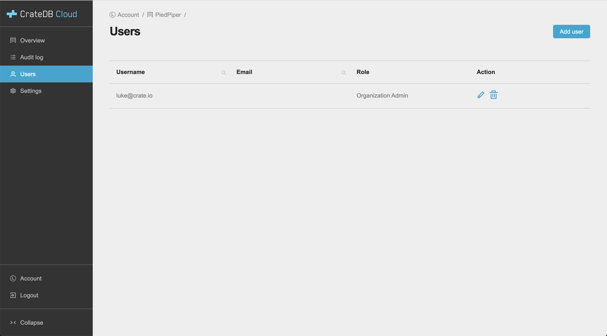
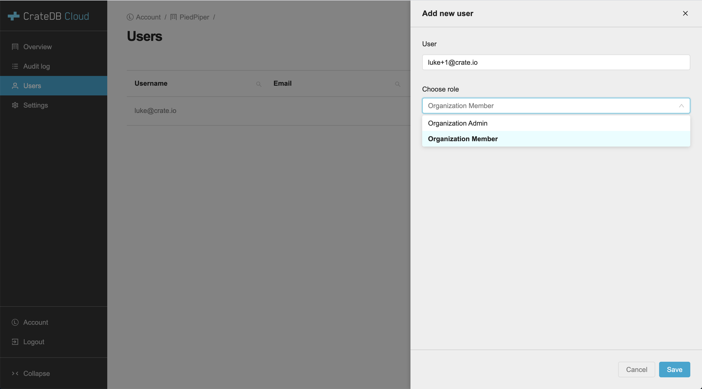
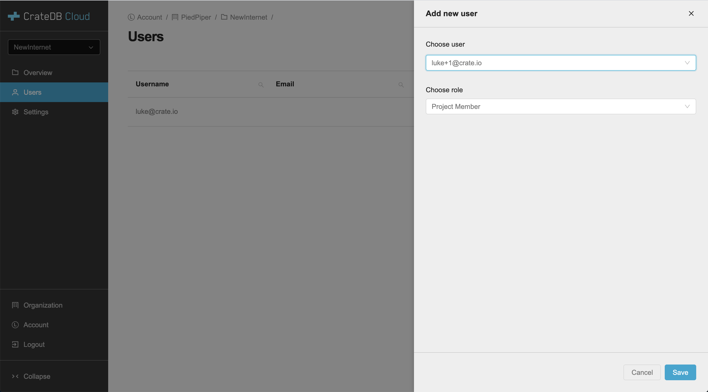

.. _add-users:

=========
Add users
=========

A guide on how to add users to organizations and projects and how to manage
their privileges.

.. rubric:: Table of contents

.. contents::
   :local:

In CrateDB Cloud you can add team members to your organizations and projects.
In order to add a user, they must first have signed up for CrateDB Cloud. Once
they have an existing account, they can be added as a user.

.. NOTE::

    You cannot add a user to an organization if that user is already a part of
    another organization.

.. _add-users-to-org:

Adding users to an organization
===============================

New users can be added to an organization by going to the organization in the
Console and entering the *Users* menu item.

Here you get an overview of all users that are currently in the organization
including their `role`_.

To add a new user click the *Add user* button in the top right.

First, enter the email address the user signed up with.

Second, select the `role`_ you want to give the user in your organization.

Finally, click *Save*.

To edit a user's role, simply click the pen icon corresponding to that user in
the user table.

.. image:: _assets/img/editOrganizationUser.png

The dropdown menu in the *Role* column lets you change the user's role. Confirm
the change by clicking the check mark to the right.

.. _add-users-to-project:

Adding users to a project
=========================

For projects the process is similar. In the Console, go to a project and enter
the *Users* menu item.

Then, click the *Add user* button at the top right.

The dropdown list shows users who have been added to the relevant organization.
From this dropdown menu, select the desired user. Next, assign the user a role
for this specific project.

Finally, click *Save* to add the user.

To edit a user's role, simply click the pen icon corresponding to that user in
the user table.

Confirm any changes by clicking the check mark.

.. _restrictions:

Restrictions
============

- An organization needs to have at least one organization admin. It is
  therefore not possible to remove the organization admin if there is only one.

- By contrast, a project does not require a project admin. This is because every
  organization admin has access to each project of that organization without
  having to be a member of that project.

- If a user is an organization admin but added as project member to a project,
  they will still have administrative rights in that project.

.. _role: https://crate.io/docs/cloud-console/docs/user-roles.rst
