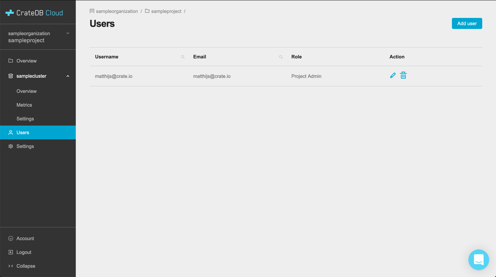

.. _add-users:

=========
Add users
=========

This is a quick guide on how to add users to organizations and projects and how
to manage their privileges. This information can also be found in the CrateDB
Cloud Console :ref:`overview<overview>` but is presented here separately for
ease of use.

.. rubric:: Table of contents

.. contents::
   :local:

In CrateDB Cloud you can add team members to your organizations and projects.
In order to add a user, they must first have signed up for CrateDB Cloud. Once
they have an existing account, they can be added as a user.

.. NOTE::

    You cannot add a user to an organization if that user is already a part of
    another organization.

.. _add-users-to-org:

Add users to an organization
============================

New users can be added to an organization by going to the Organization page in
the Console if you are logged in as organization admin. (For more information
on user roles and associated privileges, see our Documentation on
`user roles`_.) At the top, you will see three tabs labelled *Settings*,
*Users*, and *Audit Log*.

.. image:: _assets/img/organization-overviewv2.png

Click the *Users* tab to see an overview of all users associated with the
organization. It will show their username, email, and user role.

To add a new user click the *Add user* button in the top right.

.. image:: _assets/img/organization-usersv2.png

First, enter the email address the user signed up with.

Second, select the `role`_ you want to give the user in your organization.

Finally, click *Save*.

.. image:: _assets/img/organization-users-dropdownv2.png

.. _add-users-edit:

Edit and delete users from an organization
==========================================

You can also edit user roles and delete users in the *Users* tab. To edit a
user's role, simply click the pen icon corresponding to that user in the user
table. This will bring up a dropdown menu. To delete a user, use the bin icon.

.. NOTE::

    Note that in this tab you can only set organization user roles, not project
    user roles. To set project-specific user roles, see below.

.. _add-users-to-project:

Add users to a project
======================

For projects the process is similar. You can add users to a project if you are
an organization admin or an admin of the relevant project. In the Console, go
to a project in the *Projects* page overview. You will see a list of all
projects created within the organization on this page, with name, timestamp of
creation, project ID, and region of deployment.

.. image:: _assets/img/projectsv2.png

Click on the project you want to add users to to select it. Below the divider
line in the left-hand menu are shown the project-specific options. Go to the
*Users* page in this menu. Here, you will see an overview of all users
associated with the project, as well as their email address and role.

To add a user, click the *Add user* button at the top right. Choose a user and
the project role you want them to have.

.. image:: _assets/img/project-users-dropdownv2.png

Finally, click *Save* to add the user.

To edit a user's role, simply click the pen icon corresponding to that user in
the user table. To delete the user from the project, click the bin icon.

.. _restrictions:

Restrictions
============

- An organization needs to have at least one organization admin. It is
  therefore not possible to remove the organization admin if there is only one.

- By contrast, a project does not require a project admin. This is because
  every organization admin has access to each project of that organization
  without having to be a member of that project.

- If a user is an organization admin but added as project member to a project,
  they will still have administrative rights in that project.

.. _role: https://crate.io/docs/cloud/reference/en/latest/user-roles.html
.. _user roles: https://crate.io/docs/cloud/reference/en/latest/user-roles.html