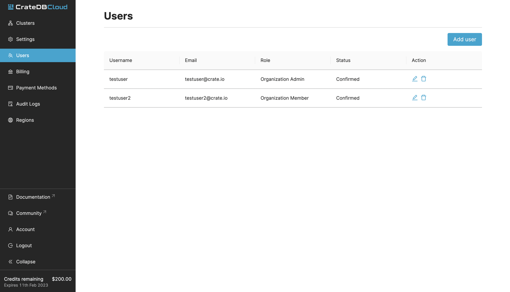
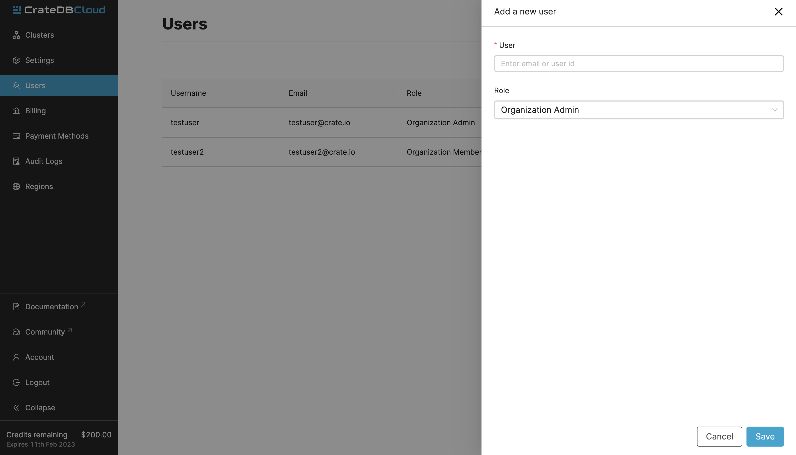

.. _add-users:

=========
Add users
=========

This is a quick guide on how to add users to organizations and
how to manage their privileges. This information can also be found in the
CrateDB Cloud Console :ref:`Overview <cloud-reference:overview>` but is
presented here separately for ease of use.

.. rubric:: Table of contents

.. contents::
   :local:

In CrateDB Cloud you can add team members to your organizations.
In order to add a user, they must first have signed up for CrateDB Cloud. Once
they have an existing account, they can be added as a user. Users can be
members or admins of more than one organization at a time, but every
organization must have at least one organization admin (see also Restrictions
below).

.. _add-users-to-org:

Add users to an organization
============================

New users can be added to an organization by going to the Users tab in the
left-hand menu. To add and manage users of the organization, you must be the
organization admin. (For more information on user roles and associated
privileges, see our documentation on 
:ref:`user roles <cloud-reference:user-roles>`.)

On this page you can see an overview of all users associated with the
organization. It will show their username, email, user role, and their status.

To add a new user click the *Add user* button in the top right. Then you can
add new user either by their email, or their user ID. You can also choose
whether the user should have admin privileges.

.. _add-users-edit:

Edit and delete users from an organization
==========================================

You can also edit user roles and delete users in the *Users* tab. To edit a
user's role, simply click the pen icon corresponding to that user in the user
table. This will bring up a dropdown menu. To delete a user, use the bin icon.

.. _restrictions:

Restrictions
============

- An organization needs to have at least one organization admin. It is
  therefore not possible to remove the organization admin if there is only one.
