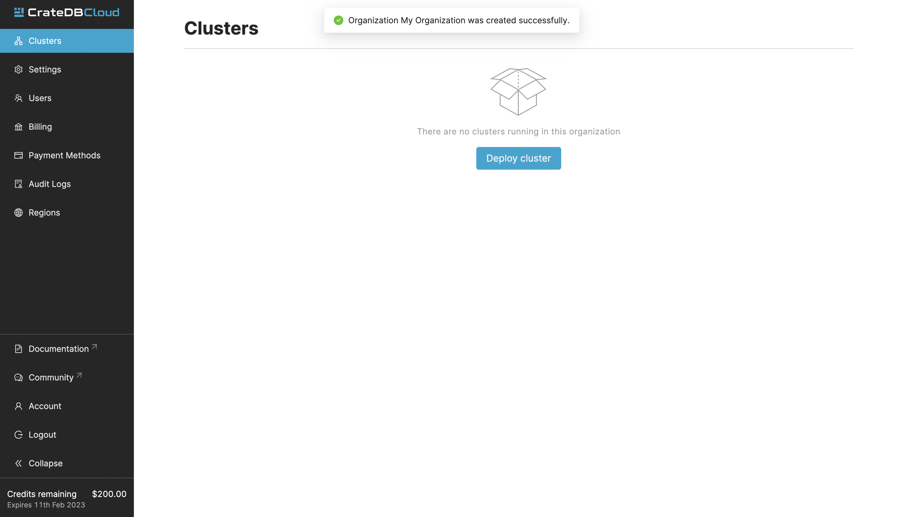
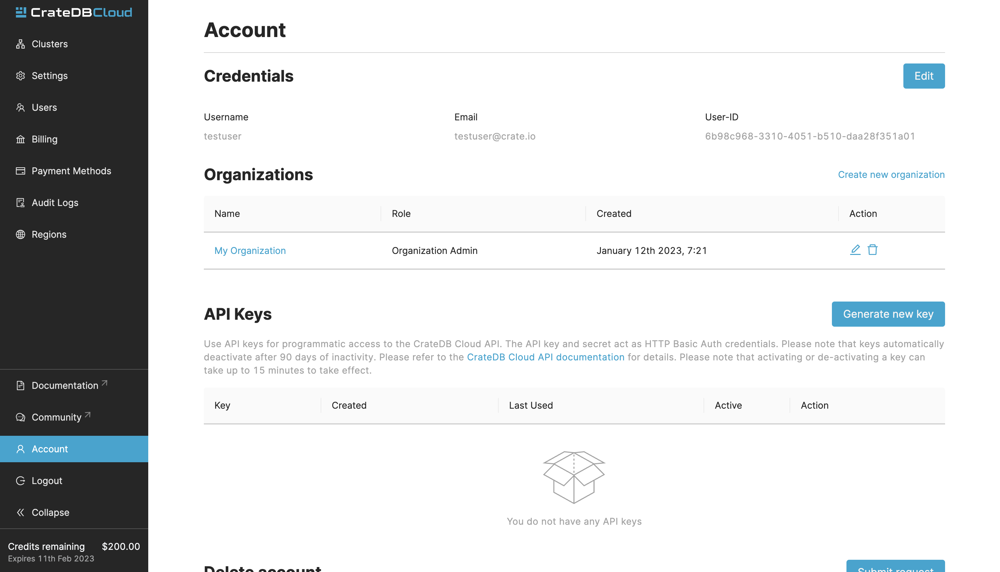

.. _create-org:

=========================
Create a new organization
=========================

This is a guide on how to create a new organization in the CrateDB Cloud
Console. If you follow the `cluster deployment tutorial`_, your first
organization will be automatically created for you. There are scenarios where
you may want to create a new organization, however. If you arrive at the
Console for the first time, or if you have deleted your last organization, you
will have to create an organization to use the CrateDB Cloud Console's
functionality. If you wish to create multiple organizations when you are
already in one, the process is slightly different. This guide will show you
both methods.

.. rubric:: Table of contents

.. contents::
   :local:

.. _create-org-new:

Create a first organization
===========================

When you first access the CrateDB Cloud Console after signing up, you will
arrive at the Cluster overview page. You will also be informed, that your 
first organization named "My Organization" has been created for you.

.. _create-org-multiple:

Create multiple organizations
=============================

If you are already in an organization and want to create another one, go to
the Account tab. Here you will see a list of all your organizations and your
`user role`_ in them.

To create a new organization, click on *Create new organization* at the top
right above the organization list. When prompted, simply input the name of
your new organization and confirm by clicking *Create organization*. To delete
an organization, click the trashcan icon next to the organization in the list.

To switch the active organization, click on the organization name in the list.
All organization and cluster management options displayed in the CrateDB Cloud
Console will then refer to that organization until you switch organizations
again.

.. _cluster deployment tutorial: https://crate.io/docs/cloud/tutorials/en/latest/cluster-deployment/stripe.html
.. _user role: https://crate.io/docs/cloud/reference/en/latest/user-roles.html