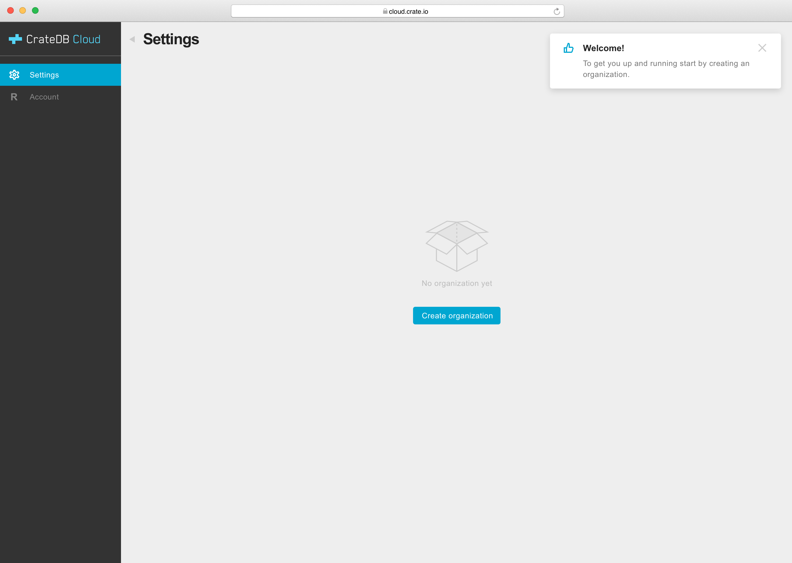
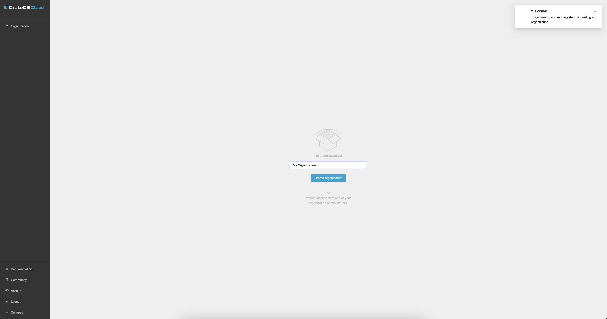
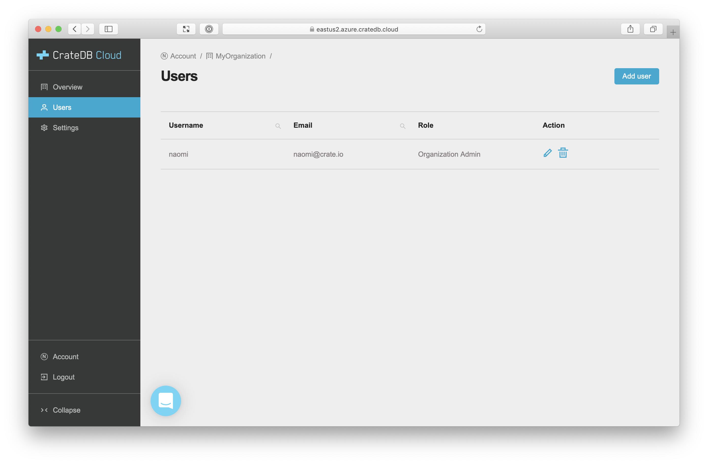

.. _create-org:

=========================
Create a new organization
=========================

A guide on how to create a new organization in the CrateDB Cloud Console.

.. rubric:: Table of contents

.. contents::
   :local:

.. _create-org-account:

The Account Overview page
=========================

When you first access the CrateDB Cloud Console, you will arrive at the Account
Overview page. If you have not previously created an organization, the page will
display an empty box logo and the message *No organization yet*.

Underneath this logo, click the button *Create organization*. A tab will appear
prompting you to name the organization.

Once you have decided on a name, click *Create* in the bottom right corner
to proceed. When the organization has been created, you will be returned to the
Account Overview page, where the organization will now be listed.

.. _create-org-overview:

The Organization Overview page
==============================

To access the Organization Overview page, click *View* in the top right corner
of the organization listing in the Account Overview page.

.. image:: _assets/img/account-overview-2.png

Here, you will see an overview of all projects and an option to create a new
project. For more information about creating new projects, see our `guide on
creating a new project`_.

.. _create-org-users:

The Organization Users page
===========================

In the Organization Users page, you will see all current users along with their
associated username, email, and role, as well an option to add a user.

For more on adding users, see our `guide to adding users to organizations and
projects`_. To understand roles and role definitions, see our `guide to user
roles in CrateDB Cloud`_.

.. _create-org-settings:

The Organization Settings page
==============================

The Organization Settings page lists the organization name, the notification
email, the notification setting, and the organization ID.

.. image:: _assets/img/org-settings-2.png

At the top right you will find the main buttons to interact with the
organization. To delete the organization, click *Delete* and verify by typing
the organization name into the popup tab. Note that in order to delete an
organization, you must first delete all associated projects.

For more on creating and deleting projects, see our `guide to creating
projects`_.

The *Edit* button allows you to change the organization name, the notification
email, and the notification setting. If you set notifications to enabled and
provide a valid notification email, CrateDB Cloud will send relevant operational
notifications via email to that address.

.. _guide on creating a new project: https://crate.io/docs/cloud-console/docs/create-project.rst
.. _guide to adding users to organizations and projects: https://crate.io/docs/cloud-console/docs/add-users.rst
.. _guide to user roles in CrateDB Cloud: https://crate.io/docs/cloud-console/docs/user-roles.rst
.. _guide to creating projects: https://crate.io/docs/cloud-console/docs/create-project.rst
