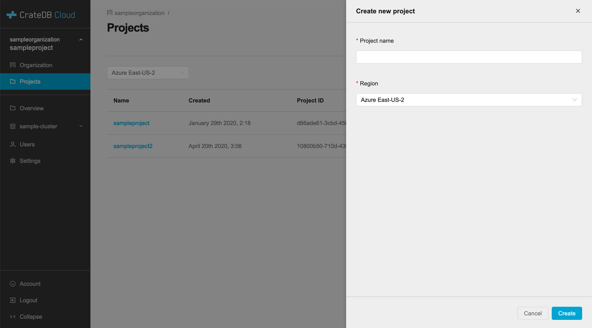

.. _create-project:

====================
Create a new project
====================

A guide on how to create a new project in the CrateDB Cloud Console.

.. rubric:: Table of contents

.. contents::
   :local:

.. _create-project-organization:

The Organization page
=====================

When you first access the CrateDB Cloud Console, you will arrive at the
Organization overview page. This page displays your organization with the name
you selected, further subscription options, and any deployed clusters.

.. image:: _assets/img/organization-overview.png
   :alt: Cloud Console organization overview

In order to create a new project within the organization, click on the
*Projects* tab in the left-hand menu to go to the Projects page.

.. _create-project-project:

The Projects page
=================

In the Projects page you will see an overview of any already extant projects.
It will show their name, timestamp of creation, project ID, and region of
deployment.

.. image:: _assets/img/projects.png
   :alt: Cloud Console projects overview

Here, you can create a new project. To do so, click the *Create Project* button
at the top right. It will prompt you for a project name and a region you want
the project to be based in.

Fill out the desired information and confirm by clicking *Create* at the bottom
right corner.

Once a project has been created and is listed on the Projects page, you can
click on that project there to select it. Below the divider line on the
left-hand menu, the tabs for *Overview*, *Users* and *Settings* will now refer
to the selected project. For more information on how to interact with the
project through these pages, see their description in the
:ref:`cloud-reference:overview` in our documentation.
