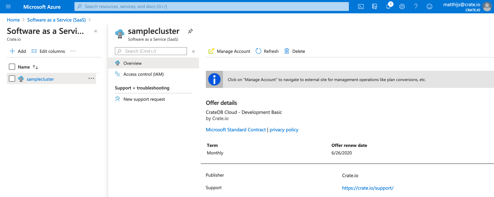
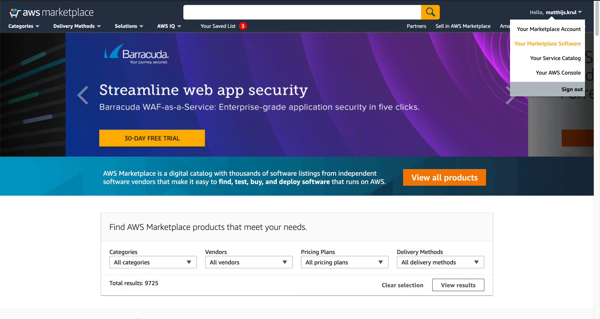

.. _delete-cluster:

================
Delete a cluster
================

This is a guide on how to delete a CrateDB Cloud cluster. It consists of two
parts: one describes the process of deleting a cluster created through
Microsoft Azure, the other is for a cluster created through AWS. For Azure,
there are in turn two methods: via the CrateDB Cloud Console and through the
Azure Portal. Each are outlined in the Azure section.

Although the `general documentation`_ for the CrateDB Cloud Console explains
how you can delete a cluster specifically within the Console, this tutorial
provides a step-by-step guide for *all* methods of deleting a CrateDB Cloud
cluster. This is to make the process more transparent and easier to find and
use.

.. WARNING::

    All cluster data will be lost on deletion. This action cannot be undone.

.. rubric:: Table of contents

.. contents::
   :local:

.. _delete-cluster-azure:

Microsoft Azure
===============

If you have followed the steps of our `tutorial`_ on how to set up a cluster
from scratch via Microsoft Azure, you should have one running. (If not, refer
to that tutorial for instructions.) If you created your CrateDB Cloud cluster
via the Microsoft Azure offering, you have two different ways to delete a
cluster once it has been created. The first is through the CrateDB Cloud
Console itself; the second is via the Microsoft Azure SaaS listing. We will
describe each process below.

.. _delete-cluster-az-console:

Deleting a cluster via the CrateDB Cloud Console
------------------------------------------------

The easiest and preferred way to delete a cluster is via the CrateDB Cloud
Console. Make sure you are logged in to the Console with a user that has org
admin access. (For more on what that means, please see our documentation on
`user roles`_.)

In the Console, first we have to select the correct project within which the
cluster was deployed. To do this, go to the Projects page. Here you will see
an overview of all projects. (If you followed the previous tutorial, there
should be just one.)

.. image:: _assets/img/projects.png
   :alt: Cloud Console projects overview

Select the relevant project by clicking on it. Make sure the correct region is
displayed in the regions dropdown menu to see the correct project, or select
'All' in the dropdown menu.

Next, we need to display the cluster in question. To do this, we need to access
the Cluster Settings page in the left-hand sidebar, below the divider line. The
name of the cluster you have created should appear in this sidebar; simply
click on it and the menu will 'roll out', showing the Settings option. This is
the one we want. Clicking this will lead to the Cluster Settings page for the
cluster.

.. image:: _assets/img/cluster-settings.png
   :alt: Cloud Console cluster settings

On this page, you will see size and scaling information for the cluster in
question. You can delete the cluster here as well. Simply click the bin icon at
the top right. It will ask for confirmation; provide it and the cluster will be
deleted.

.. _delete-cluster-az-portal:

Deleting a cluster via the Microsoft Azure Portal
-------------------------------------------------

As an alternative option, you can also delete a cluster - once deployment has
been confirmed in the CrateDB Cloud Console - directly via the Microsoft Azure
Portal. If you followed the `tutorial`_ on deploying a cluster from scratch
using the Azure Marketplace, you will already be familiar with it.

To delete a cluster via the Azure Portal, first we must head to the `Azure
Portal homepage`_. Make sure you are logged in with the correct account
while on this page.

If all is well, you should be able to see a section titled *Azure Services* on
the landing page. If you have recently used a SaaS resource, you should find in
this overview the item "Software as a Service (SaaS)". If this item is not
present in the list, go to the search bar at the top (which says *search
resources, services, and docs*) and enter "SaaS" there. The SaaS item should
then appear in the list of results.

Click on this icon. If you have subscribed to the CrateDB Cloud offer and have
deployed a cluster previously, the cluster name should now appear in the list
of SaaS items.

All that remains is to click directly on the relevant cluster name (you do not
need to tick the box). This will take you to a screen with cluster details.

To delete the cluster, press the *Delete* button at the top right and confirm.

.. _delete-cluster-aws:

AWS
===

.. _delete-cluster-aws-marketplace:

Deleting a cluster via the AWS Marketplace
------------------------------------------

You can deploy a cluster on CrateDB Cloud via AWS by subscribing to our offer
on the `AWS Marketplace`_. The offer will refer you to the CrateDB Cloud wizard
where you can configure your plan and cluster. Finally, this process will lead
you to the CrateDB Cloud Console.

To delete a cluster created in this way, you must unsubscribe from the AWS
Marketplace offer. To do so, go to the AWS Marketplace landing page. Make sure
you are logged in with the account with which you have subscribed to the offer.

On the landing page, find your account name in the top right corner, and in the
dropdown menu, select *Your Marketplace Software*.

This will take you to an overview of your AWS Marketplace subscriptions. You
should see CrateDB Cloud there. Each subscription item has a button labelled
*Manage*. Click this button for CrateDB Cloud.

.. image:: _assets/img/aws-subscriptions.png
   :alt: AWS Marketplace subscription management page

You will now see a page with the CrateDB Cloud "pay as you go" offer on it. At
the top right corner there is a button labelled *Actions*.

.. image:: _assets/img/aws-cratedbcloud.png
   :alt: AWS Marketplace subscription CrateDB Cloud

This generates a drop-down menu with various options for interacting with the
offer. In this menu, click the option *Cancel subscription*.

A warning will appear, stating that cancelling the subscription will not
terminate your running services. Do not worry: upon receiving a notice of
cancellation of the subscription, the CrateDB Cloud team will terminate your
running services for you. Therefore, you can safely cancel your subscription
at this prompt to delete your cluster.

.. _delete-cluster-billing:

Billing
=======

Crate.io only bills for actual cluster usage. During cluster operation, this is
on a per-hour basis. As soon as the cluster is deleted, nothing further will be
billed for that cluster.

.. _AWS Marketplace: https://aws.amazon.com/marketplace/pp/B089M4B1ND
.. _Azure Portal homepage: https://portal.azure.com/#home
.. _general documentation: https://crate.io/docs/cloud/howtos/en/latest/overview.html
.. _tutorial: https://crate.io/docs/cloud/tutorials/en/latest/getting-started/azure-to-cluster/index.html
.. _user roles: https://crate.io/docs/cloud/reference/en/latest/user-roles.html