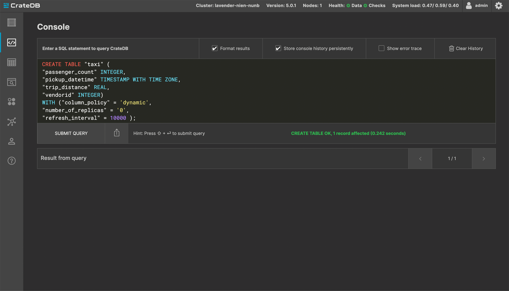
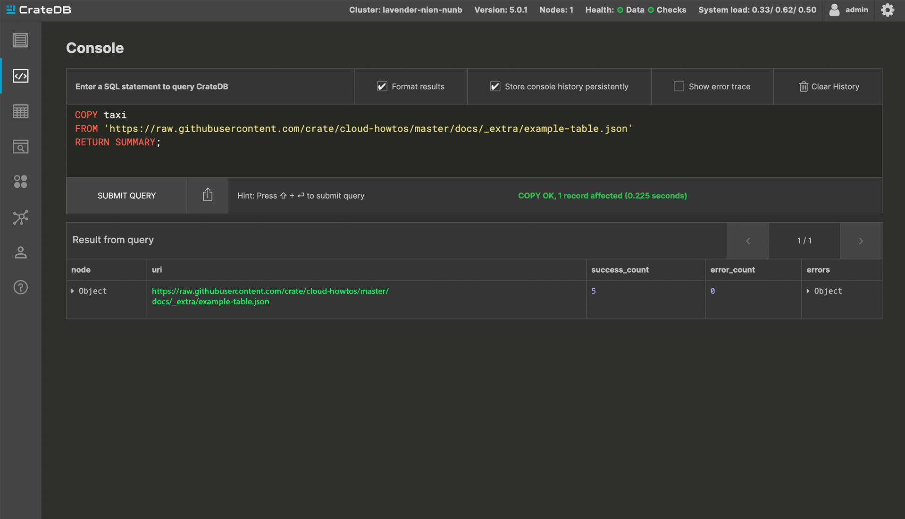

.. _import-data:

===========
Import data
===========

This guide demonstrates how to import data into your CrateDB Cloud
cluster. This how-to assumes that you already have a cluster running. If you
need help starting a cluster, please see :ref:`tutorial on how to deploy a
cluster for the first time <cloud-tutorials:cluster-deployment>`.

.. rubric:: Table of contents

.. contents::
   :local:

.. _AVC-d:

Pre-requisite
-------------

To import data into your cluster, you need to have access to your cluster's
Admin UI. The username is always ``admin`` and the password is set upon cluster
deployment.

Create a table
--------------

Before you import the data, the table that will be filled with the data must be
created. Once logged in to the Admin panel, navigate to the console.

Our example statement looks like this:

.. code-block:: console

  CREATE TABLE "taxi" (
  "passenger_count" INTEGER, 
  "pickup_datetime" TIMESTAMP WITH TIME ZONE,
  "trip_distance" REAL,
  "vendorid" INTEGER) 
  WITH ("column_policy" = 'dynamic', 
  "number_of_replicas" = '0', 
  "refresh_interval" = 10000 );

This statement will create a table called ``taxi`` with the following columns:

- passenger_count
- pickup_datetime
- trip_distance
- vendor_id

Once submitted, you should get a response like this:

Import the data
---------------

Now that you created a table, you can proceed to fill it with data. This how-to
uses a ``COPY FROM`` statement to do that. When using ``COPY FROM`` in CrateDB,
CSV and JSON file formats are accepted. In this case, a JSON file is used.

Our example statement looks like this:

.. code-block:: console

  COPY taxi
  FROM 'https://raw.githubusercontent.com/crate/cloud-howtos/master/docs/_extra/example-dataset.json'
  RETURN SUMMARY;

This statement will import a small example dataset that is hosted in our GitHub
repository.

Once submitted, you should get a response like this:

You should see that the example 5-record dataset has been successfully
imported.

Inspect the table
-----------------

You can inspect the ``taxi`` table with the following statement:

.. code-block:: console

  SELECT passenger_count, pickup_datetime, trip_distance, vendorid
  FROM "doc"."taxi"
  LIMIT 100;

The response should look like this:

.. image:: _assets/img/import-inspect-table.png
   :alt: Admin UI inspect imported data

That concludes this guide on how to import data to CrateDB Cloud clusters.
