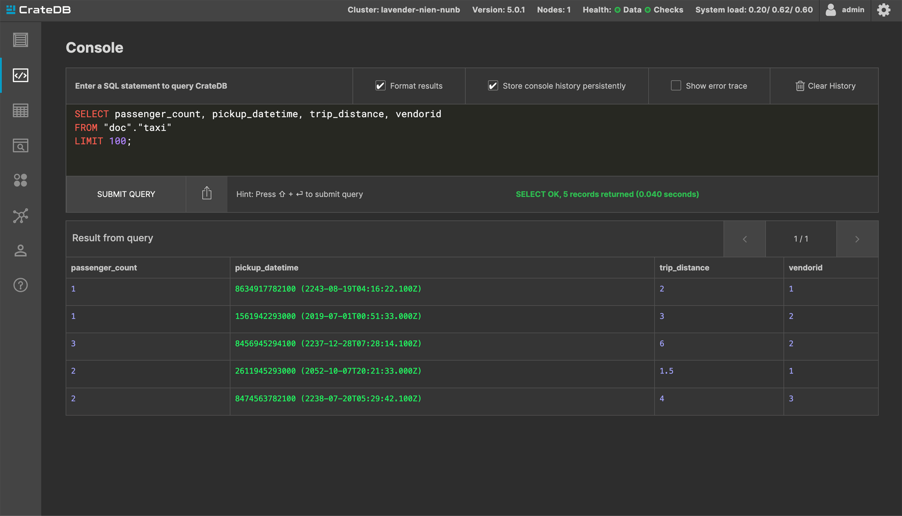

.. _import-data:

===========
Import data
===========

This guide shows two methods of importing data into your CrateDB Cloud
cluster. One is available directly in your Cloud Console, and the other in the
Admin UI of your cluster.

.. rubric:: Table of contents

.. contents::
   :local:

Import data from URL
--------------------

The more convenient method for importing data is to import from a URL
directly in your Cloud Console. See details `here`_.

Import data in the Admin UI
---------------------------

If your data isn't publicly available or is in a format unsupported by URL
import in the Cloud Console, you will have to import manually from the Admin 
UI.

.. _prerequisite:

Pre-requisite
'''''''''''''

To import data this way, you need to have access to your cluster's
Admin UI. The username is always ``admin`` and the password is set upon 
cluster deployment. Make sure to store it securely.

.. _create-table:

Create a table
''''''''''''''

Before you import the data, the table that will be filled with the data must 
be created. Once logged in to the Admin panel, navigate to the console.

Our example statement looks like this:

.. code-block:: console

  CREATE TABLE "taxi" (
  "passenger_count" INTEGER, 
  "pickup_datetime" TIMESTAMP WITH TIME ZONE,
  "trip_distance" REAL,
  "vendorid" INTEGER) 
  WITH ("column_policy" = 'dynamic', 
  "number_of_replicas" = '0', 
  "refresh_interval" = 10000 );

This statement will create a table called ``taxi`` with the following columns:

- passenger_count
- pickup_datetime
- trip_distance
- vendor_id

Once submitted, you should get a response like this:

.. image:: _assets/img/import-create-table.png
   :alt: Admin UI create a table

.. _import-data-step:

Import the data
'''''''''''''''

Now that you created a table, you can proceed to fill it with data. This 
how-to uses a ``COPY FROM`` statement to do that. When using ``COPY FROM`` in
CrateDB, CSV, and JSON file formats are accepted. In this case, a JSON file is
used.

Our example statement looks like this:

.. code-block:: console

  COPY taxi
  FROM 'https://raw.githubusercontent.com/crate/cloud-howtos/master/docs/_extra/example-dataset.json'
  RETURN SUMMARY;

This statement will import a small example dataset that is hosted in our 
GitHub repository.

Once submitted, you should get a response like this:

.. image:: _assets/img/import-copy-from.png
   :alt: Admin UI COPY FROM

You should see that the example 5-record dataset has been successfully
imported.

.. _inspect-table:

Inspect the table
'''''''''''''''''

You can inspect the ``taxi`` table with the following statement:

.. code-block:: console

  SELECT passenger_count, pickup_datetime, trip_distance, vendorid
  FROM "doc"."taxi"
  LIMIT 100;

The response should look like this:

That concludes this guide on how to import data to CrateDB Cloud clusters.

.. _here: https://crate.io/docs/cloud/reference/en/latest/overview.html#data

