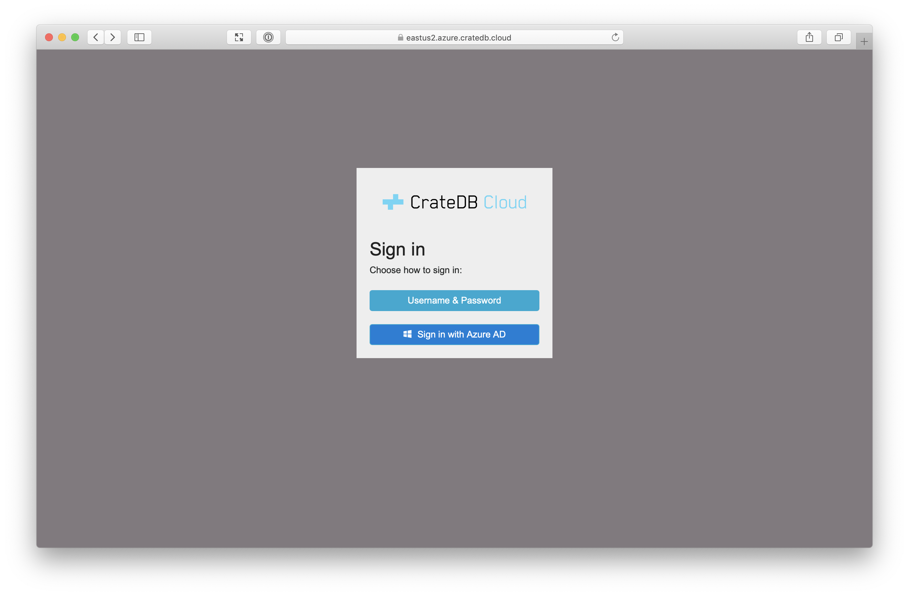
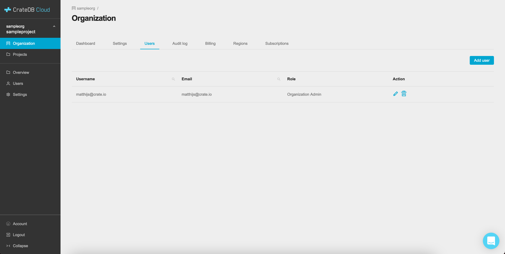
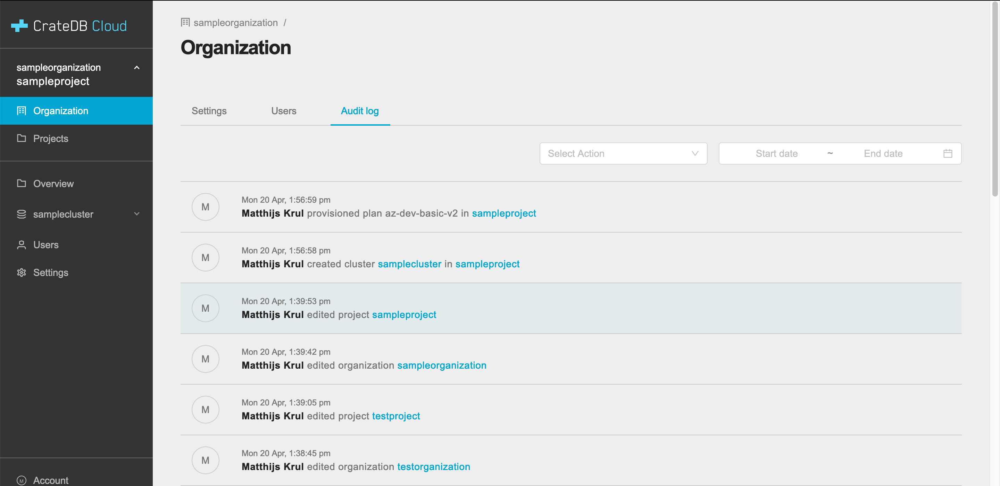
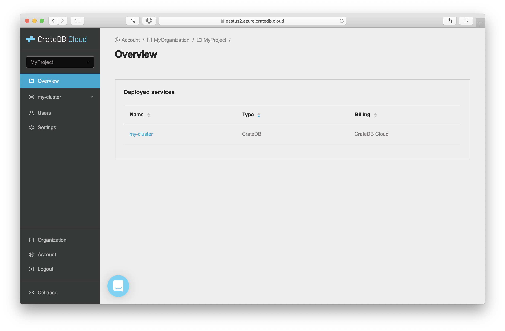
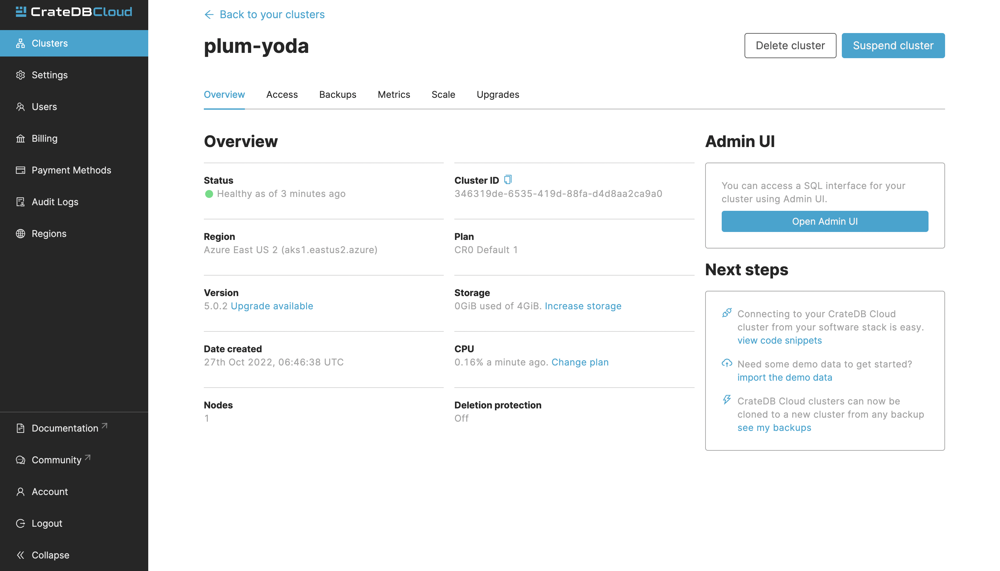
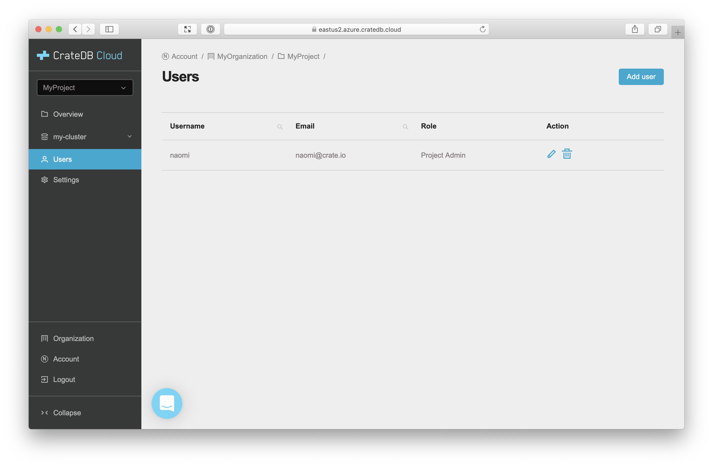
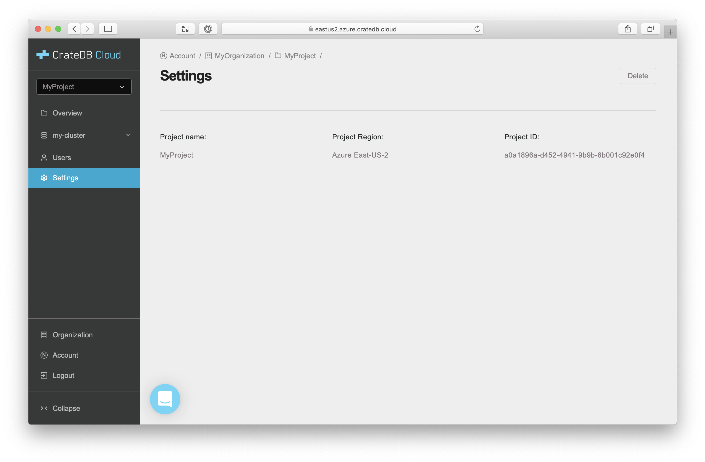

.. _overview:

================
Console overview
================

The *CrateDB Cloud Console* is a hosted web administration interface for
interacting with `CrateDB Cloud`_. This overview gives you all the basic
information for using the CrateDB Cloud Console. Refer to individual items in
the current section of the Documentation for more information on how to perform
specific operations. To understand more of the Console terminology used here,
refer to the Documentation page on `concepts`_. In the near future, we will
also provide a Glossary for more extensive terminological information.

.. rubric:: Table of contents

.. contents::
   :local:

.. _overview-basics:

Basics
======

You must access the Cloud Console by |region|.

Available regions:

+-------------------+-----------------------------------+
| Region            | URL                               |
+===================+===================================+
| Azure East-US2    | `eastus2.azure.cratedb.cloud`_    |
+-------------------+-----------------------------------+
| Azure West-Europe | `westeurope.azure.cratedb.cloud`_ |
+-------------------+-----------------------------------+
| Bregenz           | `bregenz.a1.cratedb.cloud`_       |
+-------------------+-----------------------------------+

Azure East-US2 and Azure West-Europe are managed by |Microsoft Azure|. The
Bregenz region is managed by Crate.io and is located in Austria.

Azure East-US2 is a good default region if you don't know which one to pick.

From the Cloud Console homepage, you can sign in using your Cloud Console
username and password or using Microsoft Azure *Active Directory* (AD).

If you don't have a Cloud Console account yet, select the sign-in option you
wish to use. From there, you will be given the option to sign up.

Once signed in, you will be presented with your :ref:`organization overview
<overview-org-overview>` on the Organization page.

.. _overview-org-overview:

Organization
============

The Organization page lists the organizations and projects you can access.

If you follow the `tutorial`_ instructions and deploy a test cluster,
your organization overview will look something like this:

.. image:: _assets/img/organization-overview.png

The Organization screen consists of three tabs: *Settings*, *Users*, and the
*Audit Log*. By default, it shows the Settings tab, which displays the
organization name and ID and the email notification settings. You can access
the other tabs by clicking their respective names at the top.

By clicking the *Edit* button next to the organization, you can rename it. Here
you can also set the email address for notifications and indicate whether you
want to receive them or not. By clicking *Delete*, you can delete the
organization.

.. warning::

    You cannot delete an organization without first deleting all projects
    contained within it. Deleting an organization is irreversible.

Organization Users
------------------

The next tab is the Users tab.

The Users tab shows the users associated with the organization, as well as
their user role and their email address. If you are an organization admin, you
can edit these by clicking the pen icon or delete users by using the bin icon.
To add new users to the organization, in this tab, click the *Add user* button
in the top right.

To learn more about user roles and their meaning, see our Documentation on
`user roles`_.

Organization Audit Log
----------------------

The final tab is the Audit Log tab.

This tab shows the Audit Log. In the Audit Log, a user with the correct
credentials (`an organization admin`_) can see an overview of logged changes to
the organization, the organization's projects, and other such data, each
provided with a timestamp.

.. _overview-projects:

Projects
========

The Projects page shows an overview of all current projects within the
organization, together with their timestamp of creation, project ID, and region
of deployment.

.. image:: _assets/img/projects.png

The projects are selected by region, so to see projects deployed
in other regions than the default, use the dropdown menu at the top left. You
can also create a new project for the organization in the selected region by
clicking the *Create project* button in the top right.

The cog icon next to each project takes you to the Project Settings page, in
the menu simply called Settings, as :ref:`described further below
<overview-project-settings>`.

To change your current project selection, click the project name in the list on
the main Projects page.

.. NOTE::

    The menu bar on the left hand side of the Console is divided in two by a
    line. By design, all menu items below the bar refer to the currently
    selected project, which is visible at the top left. The next sections of
    this Documentation are therefore project specific and here referred to as
    "Project Overview", "Project Settings" etc. For elegance of design,
    however, the menu bar simply says "Overview", "Settings", and so forth.
    These each refer to the project you selected on the Projects page.

.. _overview-projects-overview:

Project Overview
----------------

The Project Overview page, below the divider line, shows you the services
deployed in the currently selected project. The overview panel shows the name,
type, and SaaS subscription for billing purposes associated with each service.

Clicking on a cluster service takes you to the Cluster Overview page, which
bears the name the organization or project admin chose for the cluster. For
more details on that page, see below.

.. _overview-cluster-overview:

Cluster Overview
----------------

The Cluster Overview page gives a broad range of relevant data for the cluster
selected.

It gives you the following information:

* **Cluster name**: The cluster name.

.. NOTE::

    The cluster name, once set, cannot be changed. It makes up part of the
    unique cluster URL and is therefore permanent until the cluster is deleted.

* **Cluster ID**: The unique ID of the cluster.

* **Cluster URL**: The URL through which the cluster can be reached. The info
  icon gives relevant information on ports and access methods. By clicking on
  the URL you will be redirected to the `CrateDB Admin UI`_ for the cluster at
  that URL. For more information on the protocols used to connect to the
  respective ports, refer to the CrateDB Documentation on `HTTP`_ and the
  `PostgreSQL wire protocol`_ as well as the documentation of your client.

.. NOTE::

    The Cluster URL points to a load balancer that distributes traffic
    internally to the whole CrateDB cluster. The load balancer closes idle
    connections after four minutes, therefore client applications that require
    stateful connections (e.g., JDBC) must be configured to send keep-alive
    heartbeat queries.

* **Cluster channel**: This indicates what build of CrateDB the cluster is
  running. The options are stable, testing, or nightly.

* **Version**: This indicates the version number of CrateDB the cluster is
  running.

* **Created**: The timestamp of the deployment of the cluster.

* **Tier**: This shows what tier of the pricing plan the cluster is running on.
  For more information on our pricing plans, see the Documentation on `Azure
  plans`_.

* **RAM/Heap Size**: The currently allocated memory for the cluster.

* **Number of cores**: The number of (or fractional share of) CPU cores
  dedicated to the cluster.

* **Number of nodes**: The number of nodes the cluster consists of.

* **Storage**: The HD storage capacity allocated to the cluster, for example
  for backups.

* **Region**: The region the cluster is deployed in.

* **DB Username**: Your username used for login purposes to connect to the
  cluster. This is set in the configuration during the cluster deployment
  process.

For more information on some of the terminology used here, refer to the
`CrateDB architecture Documentation`_.

.. _overview-cluster-metrics:

Cluster Metrics
---------------

The Cluster Metrics page provides live visualizations of how the cluster is
functioning. It shows two graph panels: one for the average response time of a
query (in milliseconds) and one for the total number of queries per second.

.. image:: _assets/img/cluster-metrics.png

The differently colored graphs show the contribution of each type of query to
the total results displayed in the graph panel. These values can also be read
directly by hovering over the relevant point on the time axis (the X axis).

.. _overview-cluster-settings:

Cluster Settings
----------------

On the page for Cluster Settings you get a quick overview of the subscription
plan configuration of the cluster.

.. image:: _assets/img/cluster-settings.png

The blue box on the left shows the current cluster subscription plan, including
the tier and the scale unit. The scale unit can also be adjusted on this page.
Using the overview showing the resources and the price for different scale
units based on the selected subscription plan and tier, you can simply click
the *Edit scale unit* button to adjust the scaling to the desired level.

You can also delete your cluster here by clicking the bin icon at the top
right. It will prompt you for confirmation.

.. WARNING::

    All cluster data will be lost on deletion. This action cannot be undone.

.. _overview-project-users:

Project Users
-------------

The Project Users page shows you a list of all the users who have been added to
the project, their email address, and their user role.

You can edit or delete user data here - if you have the right user permissions
- by clicking respectively the pen icon and the bin icon. You can also add new
users to the project in this panel by clicking the *Add user* button at the top
right.

.. _overview-project-settings:

Project Settings
----------------

On the Project Settings page you will see the essential data for your selected
project. This includes the project name, the project region, and the unique
project ID.

In this screen you can delete a project by clicking the *Delete*
button at the top right. You can also change the project name by clicking the
*Edit* button next to that button.

.. warning::

    You cannot delete a project without first deleting all services deployed
    within that project. Deleting a project is irreversible.

.. _overview-account:

Account
=======

The Account page shows the current account you are using to interact with the
CrateDB Cloud Console. It shows the username as well as the email address
associated with that username.

.. image:: _assets/img/account.png

The latter can be edited in this screen by clicking the *Edit* button at the
top right.

.. _overview-logout:

Logout
======

Use the Logout button to log out of your current account and leave the CrateDB
Cloud Console.

.. _an organization admin: https://crate.io/docs/cloud/reference/en/latest/user-roles.html#organization-roles
.. _Azure   plans: https://crate.io/docs/cloud/reference/en/latest/azure-plans.html
.. _bregenz.a1.cratedb.cloud: https://bregenz.a1.cratedb.cloud/
.. _concepts: https://crate.io/docs/cloud/reference/en/latest/concepts.html
.. _CrateDB Admin UI: https://crate.io/docs/clients/admin-ui/
.. _CrateDB architecture Documentation: https://crate.io/docs/crate/howtos/en/latest/architecture/shared-nothing.html
.. _CrateDB Cloud: https://crate.io/products/cratedb-cloud/
.. _eastus2.azure.cratedb.cloud: https://eastus2.azure.cratedb.cloud/
.. _HTTP: https://crate.io/docs/crate/reference/en/latest/interfaces/http.html
.. _PostgreSQL wire protocol: https://crate.io/docs/crate/reference/en/latest/interfaces/postgres.html
.. _tutorial: https://crate.io/docs/cloud/tutorials/en/latest/getting-started/index.html
.. _user roles: https://crate.io/docs/cloud/reference/en/latest/user-roles.html
.. _westeurope.azure.cratedb.cloud: https://westeurope.azure.cratedb.cloud/
.. |Microsoft Azure| raw:: html

    <a href="https://azure.microsoft.com/" target="_blank">Microsoft Azure</a>
.. |region| raw:: html

    <a href="https://azure.microsoft.com/en-us/global-infrastructure/regions/" target="_blank">region</a>