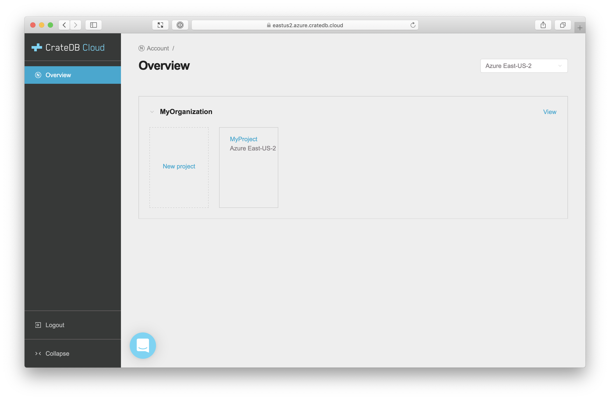
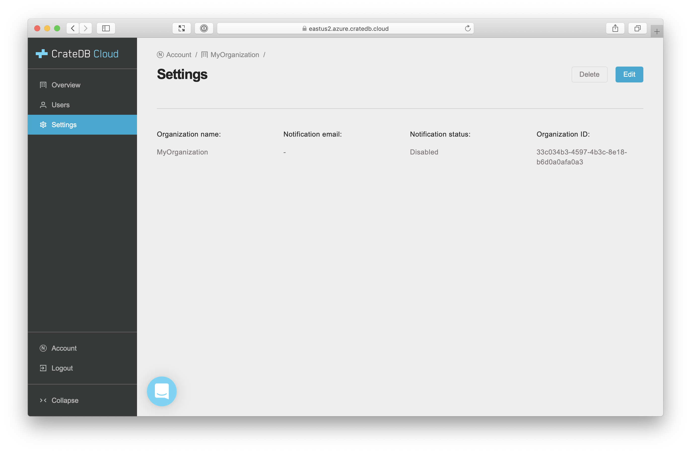
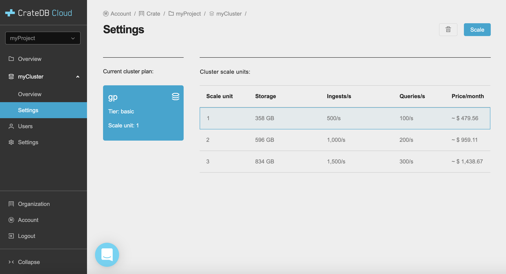
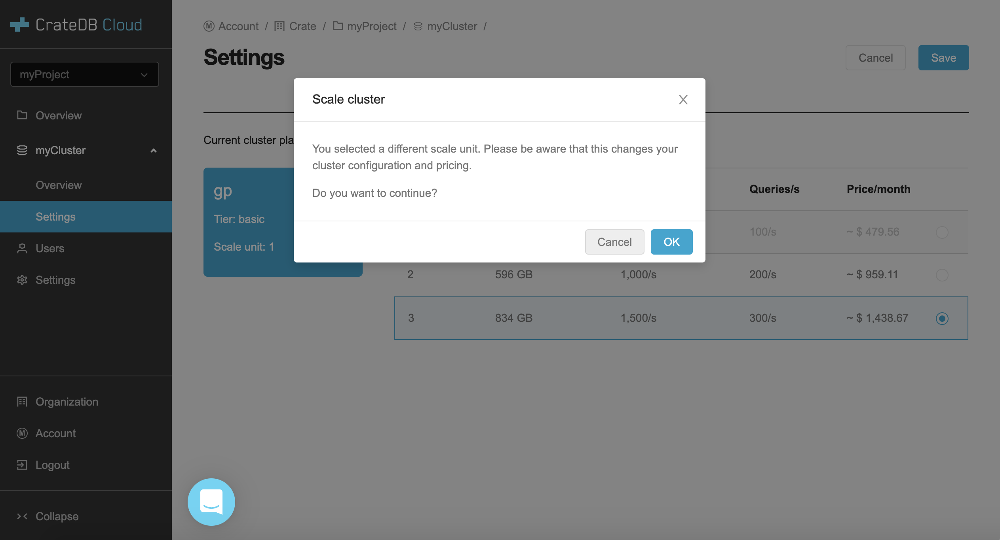
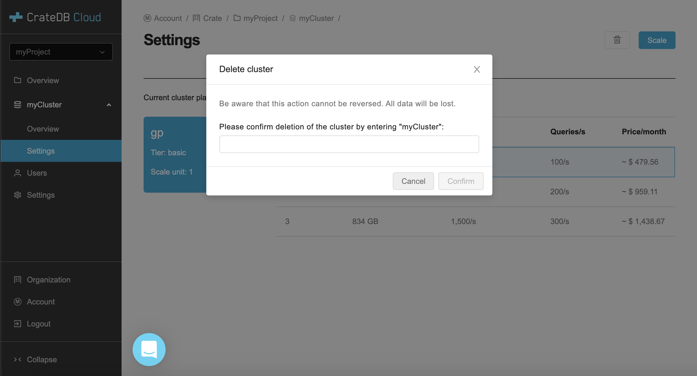

.. _overview:

========
Overview
========

The *Cloud Console* is a hosted web administration interface for interacting
with `CrateDB Cloud`_.

.. rubric:: Table of contents

.. contents::
   :local:

.. _basics:

Basics
======

.. image:: _assets/img/start.png

You must access the Cloud Console by `region`_.

Available regions:

+-------------------+-----------------------------------+
| Region            | URL                               |
+===================+===================================+
| Azure East-US     | `eastus2.azure.cratedb.cloud`_    |
+-------------------+-----------------------------------+
| Azure West-Europe | `westeurope.azure.cratedb.cloud`_ |
+-------------------+-----------------------------------+
| Bregenz           | `bregenz.a1.cratedb.cloud`_       |
+-------------------+-----------------------------------+

Azure East-US and Azure West-Europe are managed by `Microsoft Azure`_. The
Bregenz region is managed by Crate.io and is located in Austria, Europe.

Azure East-US is a good default region if you don't know which one to pick.

From the Cloud Console homepage, you can sign in using your Cloud
Console username and password or Microsoft Azure *Active Directory*
(AD).

If you don't have a Cloud Console account yet, select the sign-in option
you wish to use. From there, you will be given the option to sign up.

Once signed in, you will be presented with your :ref:`account overview
<basics-acc-overview>`.

.. _basics-acc-overview:

Account overview
----------------

The account overview screen lists the organizations and projects you
can access.

If you follow the `getting started`_ instructions and deploy a test
cluster, your account overview will look something like this:

From the main panel, you can view :ref:`organization details <orgs>`,
view :ref:`project details <project-overview>`, or :ref:`create a new
project <project-create>`. You can collapse the individual organization
widgets, so they take up less screen space.

From the left-hand navigation menu, you can log out. You can also collapse
the menu.

.. _orgs:

Organizations
=============

.. _org-overview:

Organization overview
---------------------

The organization overview screen lists all current organization projects
for a specific region:

.. image:: _assets/img/organization-overview.png

From the main panel, you can switch regions, view :ref:`project details
<project-overview>`, or :ref:`create a new project <project-create>`.
Switching regions refreshes the display to show you projects in that
region.

From the left-hand navigation menu, you can now view :ref:`organization
users <org-users>` or the :ref:`organization settings <org-settings>`.
Or, you can go back to your :ref:`account overview
<basics-acc-overview>`.

.. _org-users:

Organization users
------------------

The organization users screen lists all current users along with their
associated username, email, and role:

.. image:: _assets/img/org-users.png

From the main panel, you can edit user roles, remove users, or add users.

.. _org-settings:

Organization settings
---------------------

The organization settings screen lists the current settings for the
organization:

From the main panel, you can edit settings or delete the organization.

If you set a notification email and turn on notifications, CrateDB Cloud
will send relevant operational notifications via email.

.. _projects:

Projects
========

.. _project-create:

Create a project
----------------

If you select *Create project* from the :ref:`organization overview
<org-overview>` screen, you have the option to create a new project by
name:

.. image:: _assets/img/create-project.png

.. _project-overview:

Project overview
----------------

The project overview screen lists all currently deployed project
services along with their associated service name, type, and billing:

.. image:: _assets/img/project-overview.png

From the main panel, you can select the individual services. For CrateDB
clusters, this will bring up the :ref:`cluster overview
<cluster-overview>`.

From the left-hand navigation menu, you can now view :ref:`project users
<project-users>` or the :ref:`project settings <project-settings>`.
Notice also that deployed services appear as expandable menu items.

.. _project-users:

Project users
-------------

The project users screen lists all current users with access to the
project, along with their associated username, email, and role:

.. image:: _assets/img/project-users.png

From the main panel, you can edit user roles, remove users, or add users.

.. _project-settings:

Project settings
----------------

The project settings screen lists the current settings for the project:

.. image:: _assets/img/project-settings.png

From the main panel, you can delete the project.

.. _services:

Services
========

.. _services-cluster:

CrateDB clusters
----------------

.. _cluster-overview:

Cluster overview
................

The cluster overview screen lists the current cluster information:

.. image:: _assets/img/cluster-overview.png

From the main panel, you can visit the cluster `Admin UI`_ at the *Cluster URL*.

CrateDB clients can also use the *Cluster URL* to connect on port 4200 for
`HTTP`_  or port 5432 for the `PostgreSQL wire protocol`_. Refer to your client
documentation for more help.

.. NOTE::

    The *Cluster URL* points to a load-balancer that distributes traffic
    internally to the whole CrateDB cluster.

    The load-balancer closes idle connections after four minutes, therefore
    client applications that require stateful connections (e.g., JDBC) must be
    be configured to send *keep-alive heartbeat queries*.

.. _cluster-settings:

Cluster settings
................

The cluster settings screen lists the current cluster plan and unit.

With the *Scale* button, you are able to scale your cluster up or down,
by selecting a scale unit.

With the *Delete* button, you can delete the current cluster.

.. _Admin UI: https://crate.io/docs/clients/admin-ui/
.. _bregenz.a1.cratedb.cloud: https://bregenz.a1.cratedb.cloud/
.. _CrateDB Cloud: https://crate.io/products/cratedb-cloud/
.. _eastus2.azure.cratedb.cloud: https://eastus2.azure.cratedb.cloud/
.. _getting started: https://crate.io/docs/cloud/getting-started/
.. _HTTP: https://crate.io/docs/crate/reference/en/latest/interfaces/http.html
.. _Microsoft Azure: https://azure.microsoft.com/en-us/
.. _PostgreSQL wire protocol: https://crate.io/docs/crate/reference/en/latest/interfaces/postgres.html
.. _region: https://azure.microsoft.com/en-us/global-infrastructure/regions/
.. _westeurope.azure.cratedb.cloud: https://westeurope.azure.cratedb.cloud/
