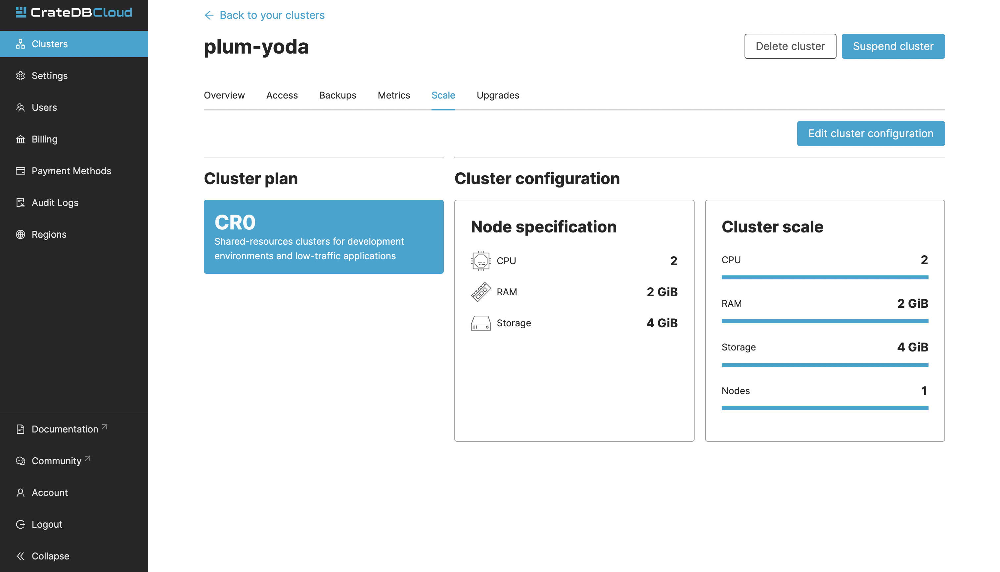
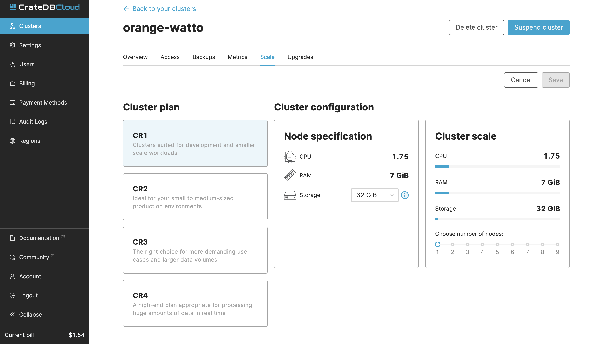

.. _reconfigure-cluster:

Reconfigure cluster
-------------------

Reconfiguring or scaling your cluster can be done in the Scale tab.
The page shows the current configuration of your cluster. You can
see your current plan, the resources of a single node, and the overall
resources of the cluster.

You can scale your cluster by clicking the *Edit cluster configuration* button
in the top-right:

Now you can do three different things:

- Change the plan of your cluster
- Increase storage on each node
- Increase/decrease the number of nodes

You can do only one of those operations at a time, i.e., you can't change 
plans and scale the number of nodes at the same time.

The difference in the price of the cluster can be seen on the bottom right, 
when choosing different configurations.

.. NOTE::

    Any promotions or discounts applicable to your cluster will be applied to
    your organization as a whole at the end of the billing period. Due to
    technical limitations, they may not be directly visible in the cluster
    scale pricing shown here, but do not worry! This does not mean that your
    promotion or discount is not functioning.

.. WARNING::

    Storage capacity increases for a given cluster are irreversible. To reduce
    cluster storage capacity, reduce the cluster nodes instead (up to a
    minimum of 2, although we recommend maintaining a minimum of 3 for
    production use).