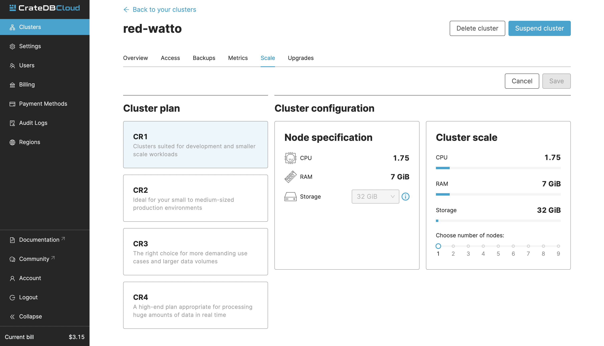

.. _scale-cluster:

=================
Scale the cluster
=================

This guide will provide a quick overview of how to scale (horizontal scaling)
your cluster using the CrateDB Cloud Console. Scaling the cluster is the best
way to increase your cluster's performance. Nodes can be both added and
removed. This guide assumes that you have a cluster up and running and can
access the Console. If not, please refer to the
:ref:`tutorial on how to deploy a cluster for the first time
<cloud-tutorials:cluster-deployment>`.

If you scale your cluster downward rather than upward, a special configuration
may be required: 
see :ref:`Important things to know <scale-cluster-important>`.

.. NOTE::

    Please be aware that as actual cluster usage is billed, scaling your
    cluster can affect your charges.

.. rubric:: Table of contents

.. contents::
   :local:

.. _cluster-scale-steps:

Steps to scaling the cluster
============================

To scale your cluster in the Console, navigate to the Clusters page in
the left-hand menu. Here you can see a list of all your clusters. Click *View*
on the cluster you wish to scale.

.. image:: ../_assets/img/clusters-overview.png
   :alt: Cloud Console Clusters overview

This will bring you to the Overview page of your chosen cluster. 

.. image:: ../_assets/img/cluster-overview.png
   :alt: Cloud Console Clusters overview

Once here, navigate to the Scale page. Simply click the *Edit cluster
configuration* to scale the cluster:

.. image:: ../_assets/img/cluster-scale-page.png
   :alt: Cloud Console Clusters overview

Now you can scale your cluster.

After you've made your changes, click *Save* to apply them.

.. _scale-cluster-important:

Important things to know
========================

When scaling a cluster, there are essential aspects to keep in mind:

- Changing your scale unit will affect pricing. It does not change the
  subscription plan within which the scale units apply.

- Scaling happens without downtime. Scaling can generally take up to an hour.

- When scaling a cluster *downward*, the number of replicas may need to be
  adjusted. This occurs when the desired number of nodes in your cluster is
  lower than the number of copies of a given table (this is the number of
  replicas + 1). For reference on how to do this, see the CrateDB
  documentation about :ref:`replication <crate-reference:ddl-replication>`.

- Horizontal scaling is often a better choice than scaling the storage itself.
  Scaling the storage is irreversible, while the cluster can be scaled down
  again.
