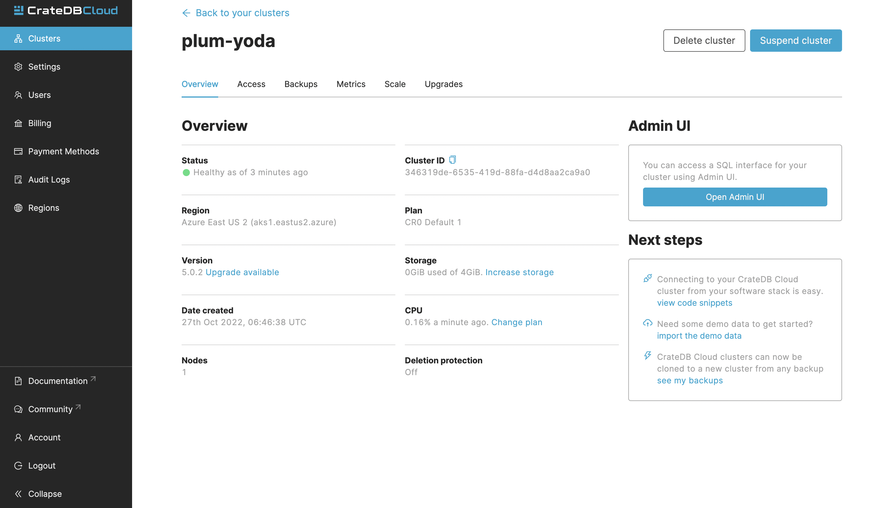

.. _scale-storage:

=================
Scale the storage
=================

This guide will provide a quick overview of how to scale (vertical scaling)
your cluster storage using the CrateDB Cloud Console. This guide assumes that
you have a cluster up and running and can access the Console. If not, please
refer to the :ref:`tutorial on how to deploy a cluster
for the first time <cloud-tutorials:cluster-deployment>`.

There are things to keep in mind when scaling storage: see :ref:`Important
things to know <scale-storage-important>`.

.. NOTE::

    Please be aware that as actual cluster usage is billed, scaling your
    cluster storage can affect your charges.

.. WARNING::

    Increasing the storage is irreversible. You should only increase storage
    when you're sure you will need it.

.. rubric:: Table of contents

.. contents::
   :local:

.. _cluster-scale-storage-steps:

Steps to scaling the storage
============================

To scale the storage of your cluster, first navigate to the Clusters page in
the left-hand menu. Here you can see a list of all your clusters. Click *View*
on the cluster where you want to scale the storage.

This will bring you to the Overview page of your chosen cluster. 

Once here, navigate to the Scale page. Simply click the *Edit cluster
configuration* to scale the storage of the cluster:

.. image:: ../_assets/img/cluster-scale-page.png
   :alt: Cloud Console Clusters overview

Now you can scale the storage of your cluster. Keep in mind that scaling
storage down again is not allowed.

.. image:: ../_assets/img/cluster-edit-storage-menu.png
   :alt: Cloud Console Clusters overview

After you've made your changes, click *Save* to apply your changes.

.. _scale-storage-important:

Important things to know
========================

When scaling the cluster storage, there are some important aspects to keep in
mind:

- Storage scaling cannot be reversed. Please make sure you need
  the storage increase before performing it.

- If you're expecting only a temporary traffic increase, scaling the amount of
  nodes in a cluster might be a better choice as this operation can be reversed.
