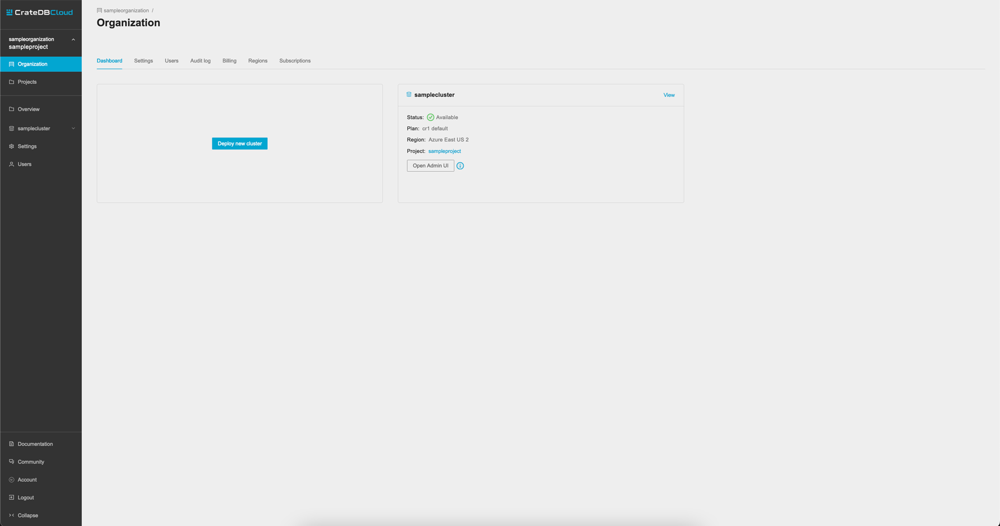
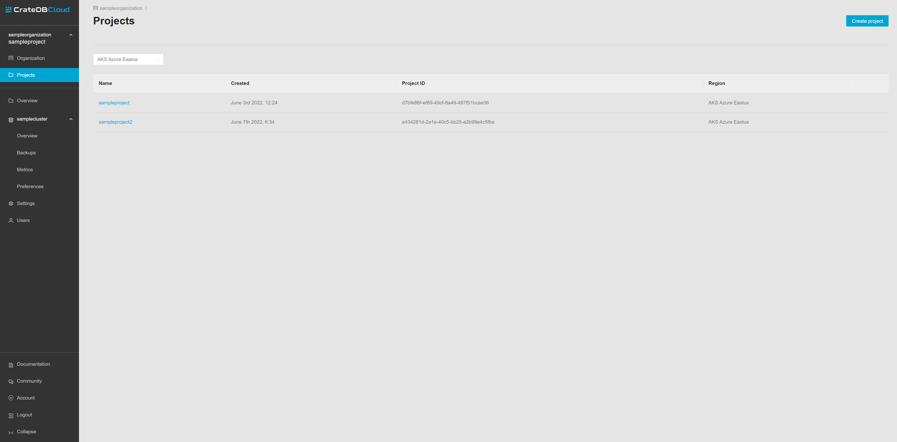
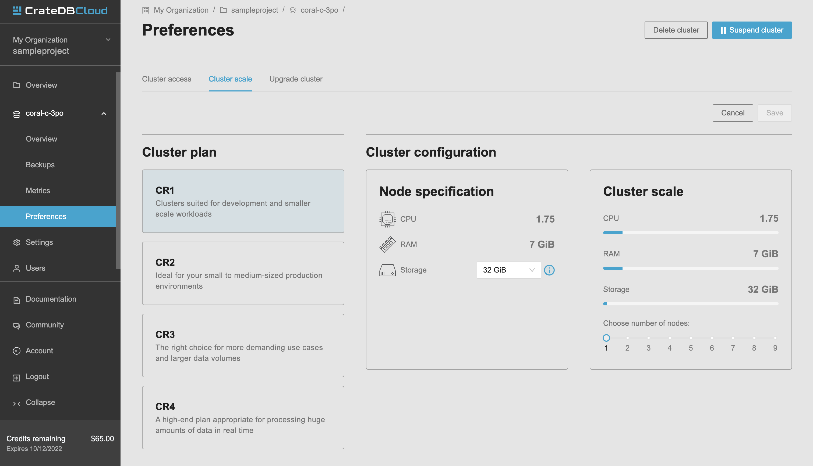

.. _scale-cluster:

===============
Scale a cluster
===============

This guide will provide a quick overview of how to scale your cluster using the
CrateDB Cloud Console. For the purposes of this guide, it is assumed that you
have a cluster up and running and can access the Console. If not, please refer
to the `guide on how to deploy a cluster via the Microsoft Azure Marketplace
for the first time`_.

If you scale your cluster downward rather than upward, special configuration
may be required: see :ref:`Important things to know<scale-cluster-important>`.

.. NOTE::

    Please be aware that as actual cluster usage is billed, scaling your
    cluster can affect your charges.

.. rubric:: Table of contents

.. contents::
   :local:

.. _scale-cluster-settings:

Find the Cluster Settings page
==============================

To scale your clusters in the Console, you must find the Cluster Settings page.
When you first access the Console, you will arrive at the Organization page.

To scale a cluster, you need to know what project the cluster belongs to. Go to
the Projects page in the left-hand menu to find an overview of all projects
associated with your organization. Select the one that has the cluster you want
to scale deployed in it. (Make sure the correct region is selected in the
dropdown menu at the top left to see the desired projects.)

In the menu on the left hand you should see below the divider line an icon or
icons representing all clusters associated with the currently selected project.
Here, find the correct cluster and click on the icon. It will expand and show
links for three pages: *Overview*, *Metrics* and *Settings*.

Click on *Settings*. This will take you to the Cluster Settings page, where
you can see the current scale unit of the cluster, as well as an information
box for the current cluster plan and tier. To scale the cluster up or down
within the permitted range, simply click the *Edit scale unit* button at the
top right.

.. image:: _assets/img/cluster-settings.png

.. _scale-cluster-instructions:

Scale a cluster
===============

Once arrived at the Cluster Settings page, you can scale the cluster you
selected in three steps. First, click the *Edit scale unit* button in the top
right.

Secondly, choose the desired scaling value in the radio button menu that
appears.

Finally, confirm with *Save*.

The values corresponding to each scale unit will vary depending on the plan
selected for the cluster. This also affects the cluster configuration and
pricing. A warning will appear to remind the user that changing scale settings
will be reflected in the charges billed.

.. _scale-cluster-important:

Important things to know
========================

When scaling a cluster, there are some important aspects to keep in mind:

- Changing your scale unit will affect pricing. It does not change the
  subscription plan within which the scale units apply.

- Scaling happens without downtime. This normally can take up to an hour.

- When scaling a cluster *downward*, the number of replicas may need to be
  adjusted. This occurs when the desired number of nodes in your cluster is
  lower than the number of copies of a given table (this is the number of
  replicas + 1). For reference on how to do this, see the `CrateDB
  documentation`_.

.. _CrateDB   documentation: https://crate.io/docs/crate/reference/en/latest/general/ddl/replication.html
.. _guide on how to deploy a cluster via the Microsoft Azure Marketplace for the first time: https://crate.io/docs/cloud/tutorials/en/latest/getting-started/azure-to-cluster/index.html
