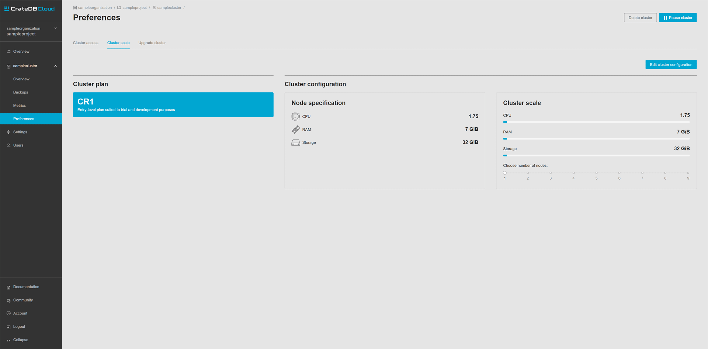

.. _scale-cluster:

===============
Scale a cluster
===============

This guide will provide a quick overview of how to scale your cluster using the
CrateDB Cloud Console. For the purposes of this guide, it is assumed that you
have a cluster up and running and can access the Console. If not, please refer
to the :ref:`tutorial on how to deploy a cluster for the first time
<cloud-tutorials:cluster-deployment>`.

If you scale your cluster downward rather than upward, special configuration
may be required: see :ref:`Important things to know <scale-cluster-important>`.

.. NOTE::

    Please be aware that as actual cluster usage is billed, scaling your
    cluster can affect your charges.

.. rubric:: Table of contents

.. contents::
   :local:

.. _scale-cluster-preferences:

Find the Cluster Preferences page
=================================

To scale your clusters in the Console, navigate to the Cluster Preferences page.
When you first access the Console, you will arrive at the Organization page.

.. image:: _assets/img/organization-overview.png
   :alt: Cloud Console organization overview

To scale a cluster, you need to know what project the cluster belongs to. Go to
the Projects page in the left-hand menu to find an overview of all projects
associated with your organization. Select the one that has the cluster you want
to scale deployed in it. Please make sure the correct region is selected in the
dropdown menu at the top left to see the desired projects.

In the menu on the left hand you should see below the divider line an icon or
icons representing all clusters associated with the currently selected project.
Here, find the correct cluster and click on the icon. It will expand and show
links for four pages: *Overview*, *Backups*, *Metrics* and *Preferences*.

.. image:: _assets/img/cluster-dropdown.png
   :alt: Cloud Console projects cluster selection

Click on *Preferences*. This will take you to cluster access page, where you
can see and edit your credentials. You can also enable deletion protection 
of your cluster and create a whitelist of IP addresses or CIDR blocks that are
allowed to connect to the cluster. 

.. image:: _assets/img/cluster-access.png
   :alt: Cloud Console cluster access settings

To edit the cluster scale, click on *Cluster scale* in the top bar. This will take
you to a page where you can see an overview of your Cluster plan as well as 
current cluster configuration.

.. _scale-cluster-instructions:

Scale a cluster
===============

Once you arrive at the Cluster scale page, you can scale the cluster you
selected in three steps. First, click the *Edit cluster configuration* button
in the top right.

Secondly, choose the desired scaling value in either the *Storage* or
*Choose number of nodes* sections.

Finally, confirm with *Save*.

.. image:: _assets/img/cluster-scale-dropdown.png
   :alt: Cloud Console cluster settings scaling menu

The values corresponding to each scale unit will vary depending on the plan
selected for the cluster. This also affects the cluster configuration and
pricing. A warning will appear to remind the user that changing scale settings
will be reflected in the charges billed. You will be able to see the new
prices of *Compute* and *Storage* in the bottom right.

.. _scale-cluster-important:

Important things to know
========================

When scaling a cluster, there are some important aspects to keep in mind:

- Changing your scale unit will affect pricing. It does not change the
  subscription plan within which the scale units apply.

- Scaling happens without downtime. This normally can take up to an hour.

- When scaling a cluster *downward*, the number of replicas may need to be
  adjusted. This occurs when the desired number of nodes in your cluster is
  lower than the number of copies of a given table (this is the number of
  replicas + 1). For reference on how to do this, see the CrateDB
  documentation about :ref:`replication <crate-reference:ddl-replication>`.
