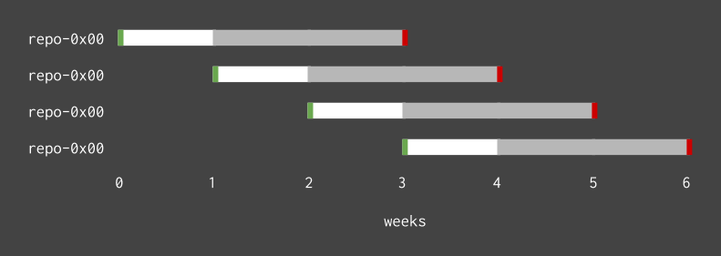

.. _snapshot:

=============================
Restore backups and snapshots
=============================

This short guide explains in general terms the CrateDB Cloud backup policy for
automatically generating snapshots of the cluster data and how one can use such
snapshots to restore data. A more detailed technical discussion of how CrateDB
handles snapshots can be found in the `CrateDB Documentation`_.

.. rubric:: Table of contents

.. contents::
   :local:

.. _snapshot-backup:

CrateDB Cloud's backup policy
=============================

CrateDB Cloud automatically backs up cluster data as snapshots based on a
recurring three week pattern. Initially, a snapshot repository is created to
hold snapshots of the cluster data. For *one week* following, this repository
is then used to store incremental snapshots of the cluster, which are taken
*every hour*.

After the one week period has been reached, a new repository is created for
storing snapshots of the same cluster. The previous repository then functions
solely for storage of older versions of the cluster data. The same happens
another week later. After a *three week* period has passed, the initial
repository (the oldest, which is now three weeks old) is dropped.

This cycle repeats indefinitely. Thanks to this backup policy, CrateDB Cloud
always has three full snapshots of the cluster data at any time - with a
maximum age of three weeks.

A visual representation of the backup policy can be seen below. (Green
indicates the creation and red the deletion of a snapshot repository, while
white indicates the period of incremental hourly snapshots added to the
repository.)

.. _snapshot-restore:

Restore a snapshot
==================

Once a snapshot of a table or partition has been created, it can be restored.
Restoring a snapshot resets that table or partition to the state it was in when
that snapshot was created.

You can restore a snapshot in two ways. One option is to `contact CrateDB Cloud
support`_. We are happy to assist. Alternatively, you can use the CrateDB Admin
UI to do it yourself. Please refer to the `Reference`_ in the documentation for
assistance.

.. _contact CrateDB Cloud support: https://help.crate.io/en/
.. _CrateDB Documentation: https://crate.io/docs/crate/reference/en/latest/admin/snapshots.html
.. _Reference: https://crate.io/docs/crate/reference/en/latest/admin/snapshots.html#restore
