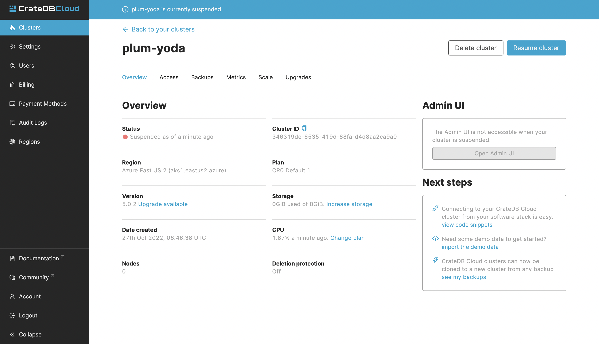

.. _suspend-cluster:

=================
Suspend a cluster
=================

This guide will provide a quick overview of how to suspend your cluster using
the CrateDB Cloud Console. For the purposes of this guide, it is assumed that
you have a cluster up and running and can access the Console. If not, please
refer to the :ref:`tutorial on how to deploy a cluster for the first time
<cloud-tutorials:cluster-deployment>`.

.. rubric:: Table of contents

.. contents::
   :local:

.. _what-is-suspension:

What is cluster suspension
==========================

Cluster suspension is a feature that enables you to temporarily pause your
cluster while retaining all its data. An example situation might be that the
project you're working on has been put on hold. The cost of running a cluster  
is split into two parts: **Compute** and **Storage**. The benefit here is that
while the cluster is suspended, you are only charged for the storage.

.. _how-to-suspend-a-cluster:

Suspend a cluster
=================

To suspend a cluster you must navigate to the Preferences page of a given
cluster, in the left-hand menu. In the top right there is a *Suspend cluster*
button.

.. image:: _assets/img/cluster-access.png
   :alt: Cloud Console cluster access preferences

After pressing it, a pop-up notification will appear. After confirming it, your
cluster will be suspended.

.. image:: _assets/img/suspend-confirm.png
   :alt: Cloud Console cluster suspend confirm

.. NOTE::

    Confirmation of suspension is displayed in the top part of the CrateDB
    Cloud console until the cluster is resumed.

     .. image:: _assets/img/suspend-notification.png
        :alt: Cloud Console cluster suspension notification

.. _how-to-resume-a-cluster:

Resume a cluster
================

To resume your cluster, simply press the "Go to *Preferences* to resume
cluster" link in the top bar, or navigate to the Cluster Preferences page
manually.

After pressing the *Resume cluster* button in the top right, your cluster will
be resumed.

.. _additional-info:

Important things to know
========================

- To suspend a cluster, you must be a Project Admin.

- You can suspend and resume clusters at any time.

- While your cluster is suspended, you will still be billed for the storage and
  the billing cycle is unaffected.

- Cluster backups do not expire while a cluster is suspended.

- The Admin UI of a cluster is unavailable while the cluster is suspended.
