.. _visualize-data-with-grafana:

===========================
Visualize data with Grafana
===========================

`Grafana`_ is an open-source tool that helps you build real-time dashboards, 
graphs, and all sorts of data visualizations. It is the perfect complement 
to CrateDB, which is purpose-built for monitoring large volumes of machine 
data in real-time.

For the purposes of this guide, it is assumed that you
have a cluster up and running and can access the Console. If not, please refer
to the :ref:`tutorial on how to deploy a cluster for the first time
<cloud-tutorials:cluster-deployment>`.

.. rubric:: Table of contents

.. contents::
   :local:

.. _grafana-load-dataset:

Load a sample dataset
=====================

To visualize data with Grafana, a dataset is needed first. In this sample, 
demo data is added directly via the CrateDB Cloud Console. To import the data
go to the Overview page of your deployed cluster. 

.. image:: /_assets/img/cluster-overview.png
   :alt: Cloud Console Clusters overview

Once on the Overview page, click on the *import the demo data* link in the
"Next steps" section of the Console. A window with 2 SQL statements will
appear. The first of them creates a table that will host the data from NYC 
Taxi &  Limousine Commission which is used in this example. The second
statement imports the data into the table created in the first step. These
statements must be executed in the shown order. First "1. Create the table" 
and then "2. Import the data".

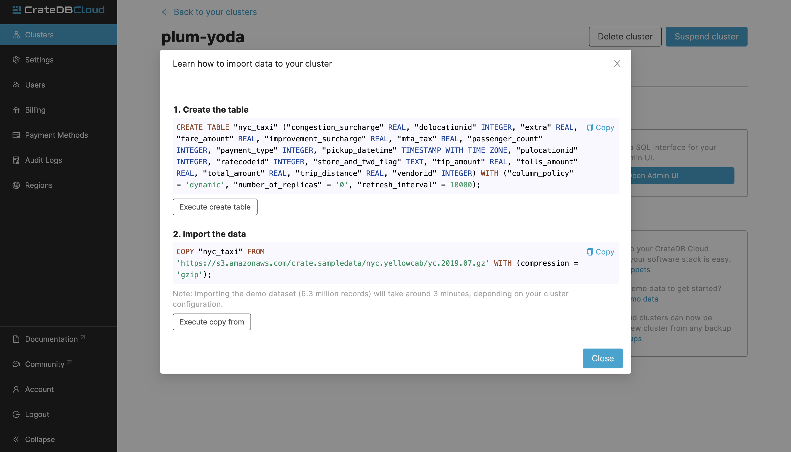

When you click on either of the *Execute* buttons, you will be brought to the
CrateDB Admin UI which is the admin UI of your cluster. When accessing it for
the first time, you will need the username and password that you set when you
deployed the cluster.

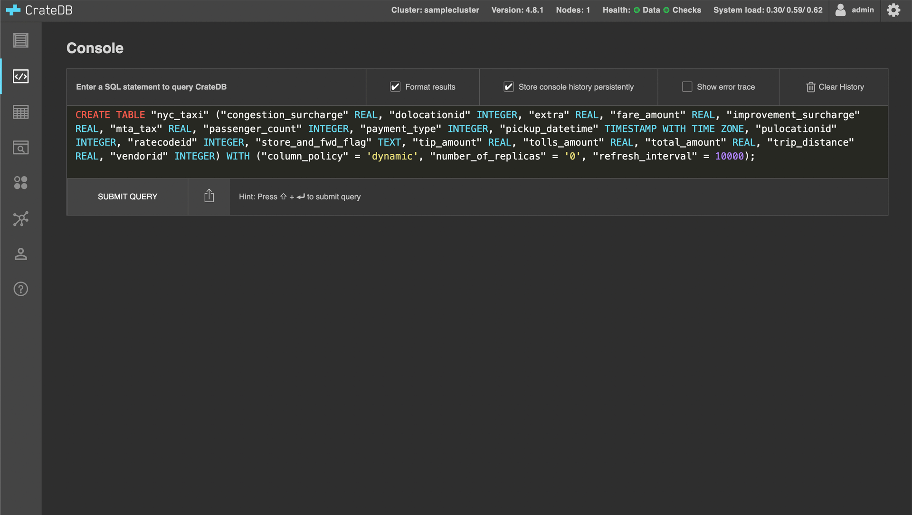

After executing the second SQL statement, the "nyc_taxi" table will be
populated with data. Depending on your cluster configuration this can take
around 40 minutes.

.. _grafana-install:

Install Grafana
===============

To install Grafana locally, refer to the `Grafana documentation`_. In this
guide, local installation is used but you can also use Grafana cloud
deployment.

.. _grafana-connect:

Connect Grafana to CrateDB Cloud
================================

After setting up and logging into Grafana, you should be greeted by
Grafana Home page.

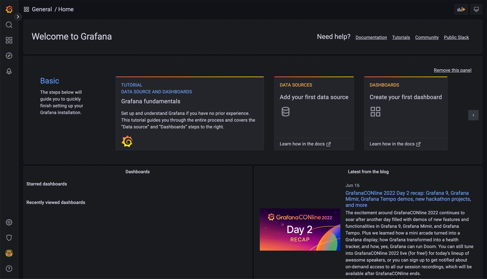

To visualize the data, you must add a data source. To do this, click on the
cogwheel "Settings" icon in the left menu bar. This should take you to the 
Data sources Configuration page. 

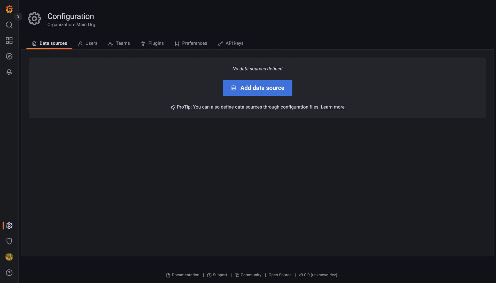

Once there, click on the *Add data source* button. Here, look up and choose
"PostgreSQL".

Once "PostgreSQL" is chosen, you will be brought to a form that you must fill
out to connect to the CrateDB Cloud. A completed example might look like the
screenshot below.

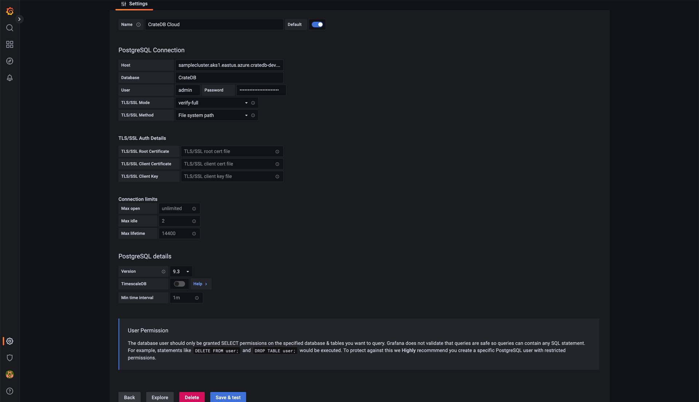

The *host* and *user* credentials may appear differently to you. The host can
be found on the Overview page of your cluster on CrateDB Cloud under the
*Learn how to connect to the cluster* link. You will want to use the psql 
link. Depending on the region where your cluster is deployed it might look
something like: 

.. code-block:: console

  samplecluster.aks1.eastus.azure.cratedb-dev.net

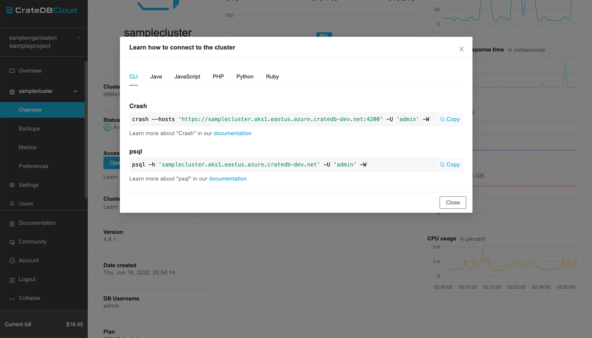

After submitting all that to the Grafana connection form, it should return
"Database Connection OK". Then, the connection is established and you can move
on to creating some dashboards.

.. _grafana-first-dashboard:

Build your first Grafana dashboard
==================================

Now that you've got the data imported to CrateDB Cloud and Grafana connected 
to it, it's time to visualize that data. In Grafana this is done using
Dashboards. To create a new dashboard click on the *Create your first
dashboard* on the Grafana homepage. You will be greeted by a dashboard 
creation page.

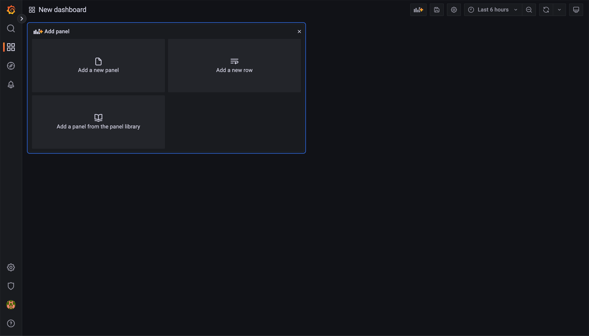

In Grafana, dashboards are composed of individual blocks called panels, to
which you can assign different visualization types and individual queries.
First, click on *Add new panel*. 

That will bring you to the panel creation page. Here you define the
query for your panel, the type of visualization (like graphs, stats, tables, 
or bar charts), and the time range. Grafana offers a lot of options for data
visualization, so this guide will showcase two simple use-cases. It is
recommended to look into the documentation on `Grafana panels`_.

To create a panel, you start by defining the query. To do that click on the
*Edit SQL* button.

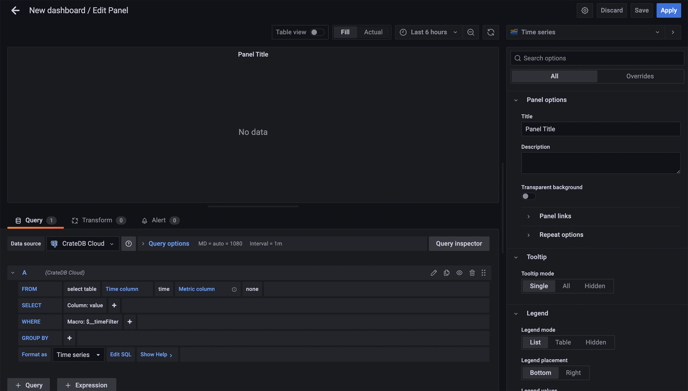

A console into which you write the SQL statements will appear. This panel will
plot the number of rides per day in the first week of July 2019:

.. code-block:: console

  SELECT date_trunc('day', pickup_datetime) AS time,
  COUNT(*) AS rides
  FROM nyc_taxi
  WHERE pickup_datetime BETWEEN '2019-07-01T00:00:00' AND '2019-07-07T23:59:59'
  GROUP BY 1
  ORDER BY 1;

.. NOTE::

   Something important to know about the "Time series" format mode in Grafana
   is that your query needs to return a column called "time". Grafana will 
   identify this as your time metric, so make sure the column has the proper 
   datatype (any datatype representing an `epoch time`_). In this query, 
   we're labelling pickup_datetime as "time" for this reason.

Once you input these SQL statements, there are a couple of adjustments you can
make:

- On the top of the panel, select the appropriate time range for your
  panel—in this case, from July 1st to July 7th, 2019:

- Under "Settings" on the right, define the name of your panel.

- Under "Display", select "Bars".

After that, you should get a panel similar to this:

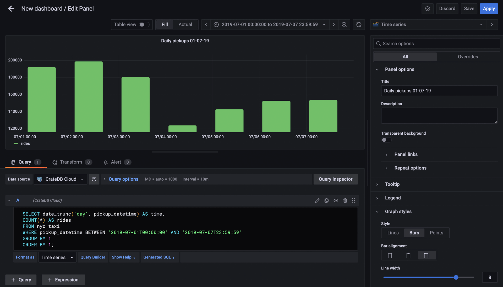

When you're satisfied with the look of the panel, click *Apply*. This will
bring you back to the overview of the dashboard. Now it will have 1 panel
created in it. Click on the *Add panel* in the top menu bar and you can create
another one.

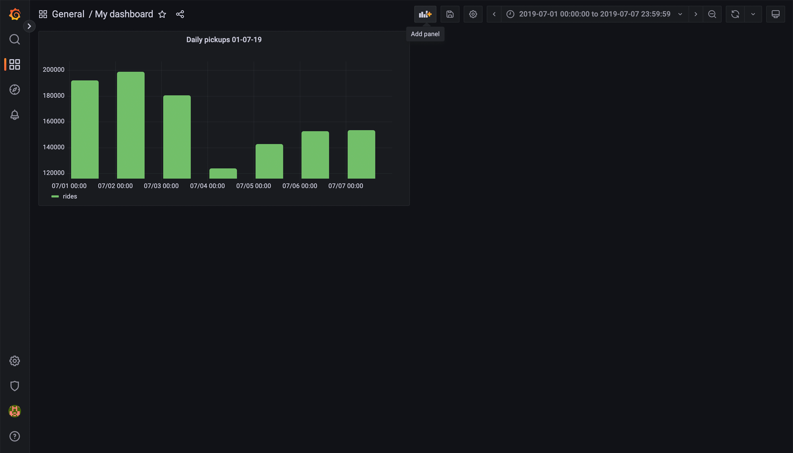

Another question worth asking might be: What was the average distance per ride
per day? To find this out, input the following SQL statement into the console
of the new panel:

.. code-block:: console

  SELECT
  date_trunc('day', pickup_datetime) AS time,
  COUNT(*) as rides,
  SUM(trip_distance) as total_distance,
  SUM(trip_distance) / COUNT(*) AS average_distance_per_ride
  FROM nyc_taxi
  WHERE pickup_datetime BETWEEN '2019-07-01T00:00:00' AND '2019-07-07T23:59:59'
  GROUP BY time
  ORDER BY 1;

Under the graph itself, click on the *average_distance_per_ride*. This will
show only the value we are interested in. Also, in the right menu under "Graph
style" select "Bars" once again. After that, you should have a panel similar 
to this:

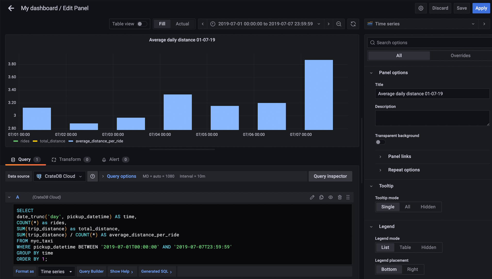

When you're happy with the panel, click *Apply*. Now, when brought back to the
Dashboard overview, you will have a collection of two very useful graphs.

Now you know how to get started with data visualization in Grafana. To find 
out more, refer to the `Grafana documentation`_.

.. _Grafana: https://www.grafana.com/
.. _Grafana documentation: https://grafana.com/docs/grafana/latest/?pg=oss-graf&plcmt=quick-links
.. _Grafana panels: https://grafana.com/docs/grafana/latest/panels/
.. _epoch time: https://en.wikipedia.org/wiki/Unix_time
